## 1.Java基础

###  1.基本数据类型

| 基本类型 | 大小(Byte)                 | 默认值       | 封装类  |
| -------- | -------------------------- | ------------ | ------- |
| byte     | 1                          | (byte)0      | Byte    |
| char     | 2                          | \u0000(null) | Char    |
| boolean  | -                          | false        | Boolean |
| int      | 4                          | 0            | Integer |
| short    | <font color='red'>2</font> | (short)0     | Short   |
| long     | 8                          | 0L           | Long    |
| float    | 4                          | 0.0f         | Float   |
| double   | 8                          | 0.0d         | Double  |

JVM中没有boolean专用的字节码，编译之后boolean使用int数据类型来代替，大小为4bytes.

boolean数组用byte数组来替代，每个元素大小为1byte.

### 2.自动装箱与拆箱

**装箱**：自动将基本数据类型转换为封装类(int --> Integer), Integer.valueOf()

**拆箱**：自动将封装类转换为基本数据类型(Integer --> int), Integer.intValue()

```java
public class Main {
    public static void main(String[] args) {
        Integer i1 = 100;
        Integer i2 = 100;
        Integer i3 = 200;
        Integer i4 = 200;
        System.out.println(i1==i2); //true  
        System.out.println(i3==i4); //false
    }
}
```

通过valueOf()创建对象时，数值在[-128, 127]之间，指向`IntegerCache.cache`中已存在的对象的引用；否则创建一个新的对象

### 3.equals与==

**==：**比较的是变量(栈)内存中存放的对象的(堆)内存地址，判断地址是否相等

**equals：**比较的是两个对象的值是否相等，继承于java.lang.Object类，Object类中的equals方法使用的是**==**

### 4.Hashcode作用

Set方法中插入元素

- 先用Hashcode方法返回一个根据对象内存地址换算出来的值
- 判断值是否存在
  - 如果不存在，插入元素
  - 如果存在，用equals判断值是否相等
    - 相等则重复
    - 不相等则

**hashcode与equals需一起<font color='red'>Override</font>**

当自定义的类需要放入散类表中(HashMap，HashSet)，需一起改写hashcode与equals

### 5.String，StringBuffer and StringBuilder

String：不可变字符串，本质是 `private final char[] value;`  数组

StringBuffer：可变字符串，`char[] value`，线程安全

StringBuilder：可变字符串，`char[] value`，线程不安全

### 6.Java四种引用

强：new String，out of memory也不会回收

软：out of memory 会被回收

弱：JVM垃圾回收器发现它，就会被回收

虚：与弱引用差不多，但回收之前会被让入ReferenceQueue

### 7.创建对象方式

new关键字

反射机制：`Person.class.newInstance()`，需要<font color='red'>`public的无参构造函数`</font>

clone机制：需实现Cloneable接口

反序列化机制：需实现Serializable接口

### 8.final关键字

被final修饰的类不可被继承

被final修饰的方法不可被改写

被final修饰的变量不可被改变，如果修饰引用，引用不可变，引用指向的值可变

被final修饰的常量，在编译阶段会存入常量池

### 9.try catch finally

不管有没有异常或return，finally都会执行，且finally的执行是在return之后

### 10.Exception and Error

常见运行时异常

1. ClassCastException
2. IndexOutOfBoundsException
3. NullPointerException
4. ArrayStoreException
5. BufferOverflowException

常见的被检查异常：需要throws or try catch

IOException

FileNotFoundException

SQLException


### 11.OOM与SOF

### 12.线程, 程序, 进程

程序：有指令和数据的文件，静态代码

进程：是程序的一次执行过程，各个进程之间是相互独立的，同一进程的不同线程可以共享内存

线程：多个线程共享一块内存空间，线程间切换工作消耗小

### 13.Java中IO流

|        | 输入流      | 输出流       |
| ------ | ----------- | ------------ |
| 字节流 | InputStream | OutputStream |
| 字符流 | Reader      | Writer       |

### 14.Java反射原理

1. 在运行时，对于任意一个类，都能知道这个类的所有属性和方法

    ```java
    Class.forName('com.mysql.jdbc.Driver.class'); /加载JDBC驱动类
    ```

2. 反射实现方式

   1. 获取类的Class对象
       1. Class.forName(类路径)
       2. 类名.class
       3. 对象名.getClass()

   2. 获取类的成员：通过Class对象可以获取类的字段，方法和构造函数
       1. getField()
       2. getMethod()
       3. getConctructor()

   3. 操作类的成员：设置/获取字段、调用方法、创建类实例
       1. Filed类中的set()和get()
       2. Method类的invoke()
       3. Conctructor的newInstance()

3. 优缺点
   1. 提高灵活性
   2. 动态编译结合
   3. 性能较低
   4. 相对不安全，破坏封装(通过反射可以获取私有方法和属性)

### 15.Object

Object是所有类的父类

1. equals：==
2. toString
3. hashCode：一般都要重写
4. clone：实现对象的浅拷贝
5. finalize：与垃圾收集器有关系，判断一个对象是否可以被回收
6. wait：配合synchronized使用， 当前线程等待该对象的锁，线程进入休眠，直到以下事件发生
   1. 其他线程调用该对象的notify
   2. 其他线程调用该对象的notifyAll
   3. 其他线程调用了interrupt
   4. 时间间隔到了
7. notify：唤醒该对象上**等待队列**中的某个线程
8. getClass

### 16.ArrayList VS LinkedList

**ArrayList**

- 优点：基于动态数组，地址连续，查询效率高
- 缺点：删除或插入数据后要移动整个数组，O(n)

**LinkedList**

- 优点：基于链表，地址任意，add和remove只需要O(1)时间
- 缺点：查询较慢

### 17.什么是fail-fast

fail-fast是Java集合(Collection)中一种错误机制。当多个线程对同一个集合的内容进行操作，就可以会有fail-fast事件

例如：线程A用iterator遍历集合时，内容被另一个线程所改变，会抛出`ConcurrentModificationException`，产生fail-fast事件

### 18. <font color='red'>HashMap、HashTable、ConcurrentHashMap、HashSet</font>

**HashMap Vs Hashtable**

| HashMap                                                      | Hashtable                                                    |
| ------------------------------------------------------------ | ------------------------------------------------------------ |
| 线程不安全                                                   | 线程安全(`synchronized`), 但不推荐用，线程安全+保证效率用`ConcurrentHashMap` |
| `key`和`value`都能是null                                     | `key`和`value`都<font color='red'>不能</font>是null          |
| 为计算效率，将哈希表的大小固定为2的幂次方，做mod运算是只需要做位运算 | 直接使用对象的`hash`值，`hash`值根据对象的地址求出int类型的数值，再用mod函数求出位置 |
| 初始长度为16，扩容为2n                                       | 初始长度为11，扩容为2n + 1                                   |

**HashMap Vs HashSet**

| HashMap                   | HashSet                                                |
| ------------------------- | ------------------------------------------------------ |
| 实现Map接口               | 实现Set接口                                            |
| 存`(k, v)`                | 存`value`                                              |
| `put(k, v)`               | `add(v)`                                               |
| 使用key时, 计算`hashcode` | 对于两个对象，先判断`hashcode`，再用`equals()`判断相等 |

**HashMap Vs TreeMap:**

实现 `NavigableMap` 接口让 `TreeMap` 有了对集合内元素的**搜索**的能力。
实现 `SortedMap` 接口让 `TreeMap` 有了对集合中的元素根据**键排序**的能力。


**HashMap的长度为什么是2的N次方**

`hash % length == hash & (length - 1)`，前提是length是2的幂次方

`&与运算`相对于`%取余运算`效率更高

### 19.**HashMap底层实现**

**JDK1.7**

拉链法：链表加数组


**JDK1.8**

链表长度大于阈值(默认为8)，将链表转换成红黑树

TreeMap、TreeSet 以及 JDK1.8 之后的 HashMap 底层都用到了红黑树。红黑树就是为了解决 二叉查找树的缺陷，因为二叉查找树在某些情况下会退化成一个线性结构。


### 20.ConcurrentHashMap

#### 20.1 JDK1.8之前

Segment数组 + HashEntry数组 + 链表，通过**分段锁**来实现线程安全

当线程占用锁访问一个段数据时，别的段数据可以被其他线程访问

segment默认大小是16


#### 20.2 JDK1.8

Node + 链表/红黑树实现，链长大于8时转成红黑树

Node + CAS + synchronized来保证并发安全

synchronized只说定当前链表的头节点

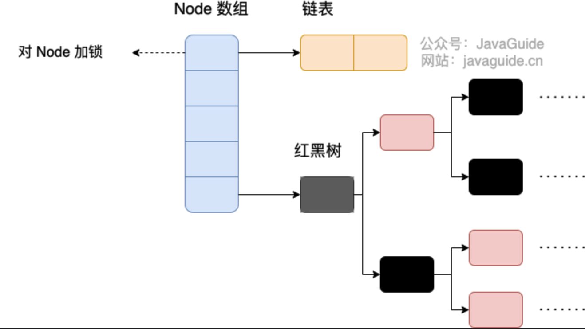

## 2.JVM

### 1.JVM整体结构


### 2.类加载

#### 2.1类加载原理

前提：java文件被编译成字节码(Class文件)

Java程序需要使用某个类时，需要经过**加载**，**连接**(验证，准备和解析)，**初始化**

类加载是由class loader完成的

- Bootstrap 根加载器：加载JVM基础核心类
- Extension 扩展加载器：java.ext.dirs系统变量所指定的类库
- System 系统加载器/应用加载器：从环境变量classpath中加载类


#### 2.2双亲委派

优点：避免类的重复加载，防止核心API被篡改

当`AppClassLoader`执行`loadClass`时

- 如果parent有值，则用`ExtClassLoader`执行`loadClass`
  - 如果parent有值，则用`BootStrapClassLoader`执行`loadClass`
  - 如果没有，则`findClass`
- 如果没有，则**越级**用`BootStrapClassLoader`执行`loadClass`

如果parent返回结果为`null`

- `AppClassLoader`执行`findClass`


```java
//删减省略版  
protected Class<?> loadClass(String name, boolean resolve)
  {
      // First, check if the class has already been loaded
      Class<?> c = findLoadedClass(name);
      if (c == null) {
          if (parent != null) {
              c = parent.loadClass(name, false);
          } else {
              c = findBootstrapClassOrNull(name);
          }
      if (c == null) {
          // If still not found, then invoke findClass in order
          // to find the class.
          long t1 = System.nanoTime();
          c = findClass(name);
      }
      return c;
  }
```

### 3.JVM内存结构

**Note**：局部变量存在java方法栈中，静态变量存在方法区中，对象存在堆中

`String a = new String("hello");` a是局部变量，“hello”是对象


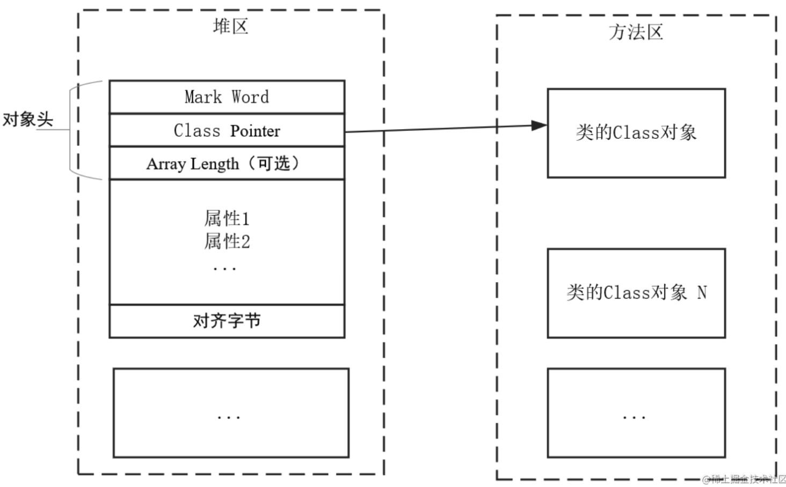

#### 3.1程序计数器

- 物理寄存器的抽象实现

- 存放带执行的下一条指令的地址

- 不会`outOfMemory`

  

#### 3.2虚拟机栈(java方法栈)

- 线程私有

- 虚拟机栈不需要垃圾回收，一个方法开始执行入栈，结束出栈

- 出现`StackOverflowError`，方法调用太多次，比如无限递归

- 出现`OutOfMemoryError`，线程太多导致没有足够内存创建虚拟机栈

- -Xss调整虚拟机栈大小

- 每一个方法对应一个**栈帧**

  - 局部变量表

    其实就是一个类表，保存方法参数和方法内局部变量的值或引用地址

    

  - 操作数栈

    执行字节码指令（用栈计算 a = 10, b = 20, c = a + b）

  - 

#### 3.3 堆

- 所有的**对象**和**数组**都存在堆中
- `-Xms`：堆初始化内存
- `-Xmx`：堆最大内存
- 通过设置`-Xms` 和`-Xmx`一样大，提高效率
- 通过`-XX: NewRatio`参数配置新生代和老年代的比例，默认新生代:老年代=1:2 
- Eden：伊甸区，新对象优先放到Eden区（如果对象大小超过Eden区，直接放入老年代）
- S0, S1：from区，to区，存放YGC后存在的对象
- eden: S0 : S1 = 8 : 1 : 1，可以通过`-XX: SurvivorRatio`调整


#### 3.4方法区

方法区存放的是Class，常量，静态变量，即使编译后的代码缓存


#### 3.5对象在堆中的流转过程

只要Eden区满了就会进行YGC，使得S0和S1区对象反复横跳，每一跳加1


### 4.垃圾回收GC

#### 4.1如何判断对象可以被回收

- 引用计数
- 可行性分析：从Root GC根节点开始向下搜索，走过的路径称为引用链。没有走到的对象是不可用的
  - 根节点是指一组被虚拟机内部硬编码的指针，这些指针指向了Java程序中所有正在使用的对象


#### 4.2回收算法

|          | 标记-清除    | 标记-整理    | 复制 |
| -------- | ------------ | ------------ | ---- |
| 速度     | 中等         | 最慢         | 最快 |
| 空间开销 | 少（有碎片） | 少（无碎片） | 最多 |
| 移动对象 | 否           | 是           | 是   |

#### 4.3分代回收

新生代对象存活时间比较短，复制算法，适合垃圾对象较多

老年代对象存活时间较长，标记-清除或者标记-整理

#### 4.4回收器

| 回收器          | 运行方式 | 描述                        | 分代   | 回收算法  | 特点                                             |
| --------------- | -------- | --------------------------- | ------ | --------- | ------------------------------------------------ |
| Serial GC       | 串行     | 执行STW，单线程进行垃圾回收 | 新生代 | 复制      |                                                  |
| Serial OldGC    | 串行     | 执行STW，单线程进行垃圾回收 | 老年代 | 标记-整理 |                                                  |
| ParNew GC       | 并行     | 执行STW，多线程进行垃圾回收 | 新生代 | 复制      | Serial  GC的多线程版本                           |
| CMS GC          | 并行     | 用户线程和垃圾回收同时执行  | 老年代 | 标记-清除 | 低暂停                                           |
| Parallel GC     | 并行     | 执行STW，多线程进行垃圾回收 | 新生代 | 复制      | 与ParNewGC相比，能动态调整内存分配情况，JDK8默认 |
| Parallel Old GC | 并行     | 执行STW，多线程进行垃圾回收 | 老年代 | 标记-整理 | Serial OldGC的多线程版本                         |
| G1              | 并行     | 用户线程和垃圾回收同时执行  | 整堆   | 分区      | 在延迟可控的情况下尽可能提高吞吐量，JDK9默认     |
| ZGC             | 并行     | 用户线程和垃圾回收同时执行  | 整堆   | 分页      | STW的时间不超过1ms                               |

- CMS

  1. 初始标记
     1. STW(Stop The World), 暂停所有工作线程
     2. 标记出GC Roots能直接可达的对象
     3. 一旦完成立即恢复工作，这个阶段时间短
  2. 并发标记
     1. 从上一个阶段标记出的对象，开始遍历老年代进行标记
     2. **耗时长**
  3. 重新标记
     1. STW，时间不长
     2. 对上阶段标记的对象进行修正
  4. 并发清除
     1. 由于使用标记-清除算法，不需要移动对象

  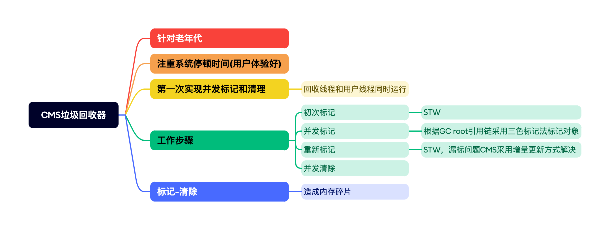

- **<font color='red'>G1</font>**

  - 每个方块是一个region，堆内存被分为2048个region，每个region大小等于堆内存/2048
  - 还是有Eden，S0，S1和老年代，但内存空间不连续。Humongous存放大对象
  - YoungGC：Eden区满，触发G1的YoungGC
  - MixedGC：老年代占用率到达`-XX:IntiatingHeapOccupancyPercent`指定百分比，回收所有的新生代和部分老年代，以及大对象区
  - FullGC：在进行MixedGC时，采用复制算法，如果复制过程中内存不足，则会触发FullGC，会STW，采用单线程标记-整理，相当于Serial GC

  

  

  1. 与CMS相同的阶段：初始标记，并发标记，最终标记
  2. 筛选回收
     1. 需要STW
     2. 通过`-XX:MaxGCPauseMillis`指定GC的STW停顿时间，默认200ms
     3. 采用复制算法

  

#### 4.5Minor GC与Full GC分别发生在什么时候

- Minor GC发生在新生代内存不够时，也叫Young GC
- Full GC 发生在JVM内存不足时。比如：使用G1回收器，在进行MixedGC时，采用复制算法，如果复制过程中内存不足，则会触发FullGC，会STW，采用单线程标记-整理，相当于Serial GC

### 5.对象在内存中的结构

- 对象头

  - Mark Word标记字：**<font color='red'>锁状态</font>**，哈希码，GC标志位
  - Class Pointer类对象指针：存放方法区的Class对象地址
  - Array Length数组长度：如果对象是一个数组，则有这个字段

- 对象体

  - 包含对象的实例变量，这部分按4字节对齐

- 对齐字节

  - 保证java对象所在内存字节为8的倍数

  

### 6.JVM调优参数

- 堆栈内存相关
  - `-Xms`：堆内存初始大小
  - `-Xmx`：堆内存最大大小
  - `-Xmn`：堆内新生代大小
  - `-Xss`：线程栈内存大小
  - 
- 垃圾收集器相关
  - `-XX:ParallelGCThreads=20`
  - 


## 3.多线程&并发

### 1.用户态，内核态，上下文切换

- 上下文切换：一个CPU核心上，一个线程被暂停，一个线程包选中开始执行的过程。存储和恢复CPU状态的过程
- 用户态线程：常规线程，创建成本小
- 内核态线程：超级线程，创建成本高
- 什么情况导致用户态到内核态
  1. 系统调用，比如IO
  2. 异常
  3. 中断
- 如果要挂起或者唤醒一 个线程，都需要操作系统帮忙完成，而操作系统实现线程之间的切换时需要从用户态转换到内核 态，这个状态之间的转换需要相对比较长的时间

### 2.线程实现方式

- 继承`Thread`类

  ```java
  public class MyThread extends Thread{
      @Override
      public void run(){
          for (int i = 0; i < 100; i++){
              System.out.println("T is running");
          }
      }
      public static void main(String[] args) {
          MyThread t1 = new MyThread();
          MyThread t2 = new MyThread();
          t1.start();
          t2.start();
      }
  }
  ```

- 实现`Runnable`接口

  `Runnable`执行`run`的返回类型是**void**

  ```java
  public static void main(String[] args) {
      Thread t = new Thread(new Runnable() {
          @Override
          public void run() {
              System.out.println("A is running");
          }
      });
      t1.start();
  }
  ```

- 实现`Callable`接口

  - `Callable`执行`call`的返回类型是**V(范型)**

  - `Future<V>`接口是用来获取异步计算结果的

    ```java
    public interface Future<V> {
        boolean cancel(boolean mayInterruptIfRunning);
        boolean isCancelled();
        boolean isDone();
        V get() throws InterruptedException, ExecutionException;
    }
    ```

  - FutureTask类实现RunnableFuture接口

    

    ```java
    public class TaskA implements Callable<Integer> {
        @Override
        public Integer call() throws Exception {
            return 100;
        }
        public static void main(String[] args) throws Exception{
          	//结合线程池
            ExecutorService pool = Executors.newFixedThreadPool(4);
            FutureTask<Integer> ft = new FutureTask<>(new TaskA());
    	      pool.submit(ft);
            ft.get();
            pool.shutdown();
          
          	//不用线程池的话
          	new Thread(ft).start();
          	ft.get();
        }
    }
    ```
- 继承关系
            
- 线程池创建

  ```java
  ExecutorService pool = Executors.newCachedThreadPool();
  executorService.execute(new Runnable() {
      @Override
      public void run() {
  				System.out.println();
      }
  });
  ```

### 3.如何停止一个正在运行的线程

- 使用退出标志，正常退出，当`run`方法完成后线程结束

  ```java
  public class ThreadSafe extends Thread {
      public volatile boolean exit = false; 
          public void run() { 
          while (!exit){
              //do something
          }
      } 
  }
  ```

- `stop`方法(**deprecated**)

- `interrupt`


### 4.Java中interrupted和isInterrupted方法区别

- `interrupted()`: Thread的static方法，返回`isInterrupted`同时清除中断状态

  ```java
  public static boolean interrupted() {
      return currentThread().isInterrupted(true);
  }
  ```

- `isInterrupted()`: 非static方法，用来判断调用线程的中断状态(true or false)

- `interrupt()`：

  - 对于任何阻塞的线程，调用`interrupt()`，可抛出`InterruptedException`中断线程

  - 对于正常运行的线程，调用`interrupt()`，将中断标志设置为`true`


### 5.Thread成员方法--Daemon, yield, join

- `setDaemon(boolean on)`守护线程，非守护线程结束后守护线程也会结束

- `yield()`礼让线程，暂时放弃正在执行的线程对象，有可能马上又抢占到CPU

- `join()`插入线程，将线程插入到别的线程

- 垃圾回收就是Daemon线程

  ```java
  //t3必须要等t2结束后，才能执行print
  Thread t3 = new Thread(new Runnable() {
      @Override
      public void run() {
          t2.join();
          System.out.println("t3 is running");
      }
  });
  ```


### 6.Thread生命周期


### 7.wait(), notify()和notifyAll()

- `wait()`

  - 线程放弃对象锁，进入等待锁定池

  - 搭配whlie循环使用，而不是if，检查`wait()`调用条件--判断条件是否真的被满足

    ```java
    while (synchedList.isEmpty()) {
        System.out.println("List is empty...");
        synchedList.wait();
        System.out.println("Waiting...");
    }
    ```

- `notify()`

  - 随机唤醒一个对象监视器上等待的线程
  - 会造成死锁：当一个线程执行完后释放该对象的锁，如果没有再次执行`notify()`，则其他等待线程不会被唤醒，发送死锁

- `notifyAll()`

  - 全部唤醒一个对象监视器上等待的线程

  **场景：使用notifyAll与wait实现一个同步列表的增加和删除元素**

  ```java
  public class RunoobTest {
      private List synchedList;
      public RunoobTest() {
          // 创建一个同步列表
          synchedList = Collections.synchronizedList(new LinkedList());
      }
      // 删除列表中的元素
      public String removeElement() throws InterruptedException {
          synchronized (synchedList) {
              // 列表为空就等待
              while (synchedList.isEmpty()) {
                  System.out.println("List is empty...");
                  synchedList.wait();
              }
              String element = (String) synchedList.remove(0);
              return element;
          }
      }
      // 添加元素到列表
      public void addElement(String element) {
          synchronized (synchedList) {
              // 添加一个元素，并通知元素已存在
              synchedList.add(element);
              synchedList.notifyAll();
              System.out.println("notifyAll called!");
          }
      }
   
      public static void main(String[] args) {
          final RunoobTest demo = new RunoobTest();
          Runnable runA = new Runnable() {
              public void run() {
                  try {
                      String item = demo.removeElement();
                      System.out.println("" + item);
                  } catch (InterruptedException ix) {
                      System.out.println("Interrupted Exception!");
                  } catch (Exception x) {
                      System.out.println("Exception thrown.");
                  }
              }
          };
          Runnable runB = new Runnable() {
              // 执行添加元素操作，并开始循环
              public void run() {
                  demo.addElement("Hello!");
              }
          };
          try {
              Thread threadA1 = new Thread(runA, "Google");
              threadA1.start();
              Thread threadA2 = new Thread(runA, "Runoob");
              threadA2.start();
              Thread threadB = new Thread(runB, "Taobao");
              threadB.start();
            
              threadA1.interrupt();
              threadA2.interrupt();
          } catch (InterruptedException x) {
          }
      }
  }
  ```

### 8.为什么wait, notify 和 notifyAll这些方法不在thread类里面?

- Java提供的锁是对象级的，每个对象都有锁，通过线程获得。
- 如果wait方法定义在Thread类中，线程正在等待哪个锁就不明显了
- wait，notify，notifyAll都是锁级别的操作，并且锁属于对象，所以把这几个方法定义在Obejct类中

### 9.为什么要把wait和notify方法在同步块中调用

- 同步块能只保证一个共享变量不会被同时读写，但不能保证顺序，wait和notify就是确定了这个顺序
- 如果不这么做，会抛出illegalMonitorStateException异常

### 10.sleep和wait()

- `sleep()`：
  - 线程方法
  - 调用sleep方法时，线程不会释放对象锁
  - 时间当了自己唤醒
- `wait()`：
  - Object类方法
  - 调用wait方法时，线程释放对象锁
  - 只要当别的线程使用notify()通知该线程唤醒

### 11.volatile是什么？可以保证有序性吗？

一旦一个共享变量（类的成员变量、类的静态成员变量）被volatile修饰后，具备的两层语意：

1. volatile**可见性保证**——变量可见性问题

   在一个多线程应用中，线程操作**非volatile变量**时，出于性能考虑，线程将变量从主存拷贝到CPU缓存中

   **解决方案：**

   Java的volatile关键字用于标记一个变量“应当存储在主存”。每次读写入一个volatile变量，应该读写到主存中，而不是仅仅读写到CPU缓存。

   

2. **部分有序性**——指令重排问题

   出于性能考虑，JVM和CPU是允许对程序中的指令进行重排的，只要保证（重排后的）指令语义一致即可

   **解决方案：**

   由于flag变量为**volatile**变量，那么在进行指令重排序的过程的时候，语句3一定在中间，但是语句1和语句2的顺序不一定，语句4和语句5的顺序不一定

   ```java
   x = 2;       //语句1
   y = 0;       //语句2
   flag = true; //语句3
   x = 4;       //语句4
   y = -1;      //语句5
   ```

### 12.Thread类中的start()和run()方法区别

- `start()`：启动新线程，内部调用`run()`
- `run()`：一般会@Override `run()`方法

### 13.有三个线程T1, T2, T3, 如何保证顺序执行

使用Thread中的`join()`方法

```java
public static void main(String[] args) {
    Thread t1 = new Thread(() -> System.out.println("t1 is running"));
    Thread t2 = new Thread(() -> {
        t1.join();
        System.out.println("t2 is running");
    });
    Thread t3 = new Thread(() -> {
        t2.join();
        System.out.println("t3 is running");
    });
    t1.start();
    t2.start();
    t3.start();
}
```

### 14.SynchronizedMap和ConcurrentHashMap的区别

- SynchronizedMap：
  - 一次锁住一整张表，所以每次只有一个线程能访问Map
- ConcurrentHashMap：
  - 采用分段锁，一次锁住一个桶
  - 默认将哈希表分为16个桶，可以有16个线程同时执行操作

### 15.synchronized

#### 15.1 用法

- 实例方法: 锁的是实例对象

  `public synchronized void increase()`

- 静态方法: 锁的是类

  `public synchronized static void increase()`

- 方法块：锁的是括号里的对象

  ```java
  public void addFirst(int num) throws InterruptedException {
      synchronized (this){
          while (!dq.isEmpty()){
              this.wait();
          }
          dq.addFirst(num);
          System.out.println("add: " + num);
          this.notifyAll();
      }
  }
  ```

#### 15.2 构造函数能加synchronized关键字修饰吗

不能，构造函数本身是线程安全

#### 15.3 synchronized锁的优化机制

- JDK1.6之前，synchronized使用重量级锁，内核mutex

- 锁的状态从低到高：**无锁 -> 偏向锁 -> 轻量级锁 -> 重量级锁**

- **自旋锁**：为了让线程等待，让线程执行一个忙循环(自旋)，`-XX:+UseSpining`开启，默认自旋10次，其目的是减少线程上下文切换

- **自适应锁**：自适应的自旋锁

- **锁消除**：锁消除指的是编译器检测到一些同步的代码块，完全不存在数据竞争的场景，也就是不需要加锁，就会进行锁消除

- **锁粗化**：如果一系列连续操作对同一个对象反复加锁和解锁，会导致不必要的性能消耗，**锁粗化**就会把锁的同步范围扩展到操作序列之外

  ```java
  public String concat(String s1, String s2, String s3){
    StringBuffer sb = new StringBuffer();
    sb.append(s1);
    sb.append(s2);
    sb.append(s3);
    return sb.toString();
  }
  ```

  ```java
  public String concat(String s1, String s2, String s3){
    String sb = new StringBuilder();
    synchronized(this){
      sb.append(s1);
      sb.append(s2);
      sb.append(s3);
    }
    return sb.toString();
  }
  ```

- **偏向锁**：

  - 当线程访问同步块获取锁时，会在对象头的锁记录里存偏向锁的线程ID
  - 线程获得锁之后就不会解锁，这样省了很多切换锁的开销
  - 在大多数情况下，锁总是由同一线程多次获得，不存在多线程竞争，所以出现了偏向锁
  - 一旦有其他线程尝试竞争偏向锁时，偏向锁失效，升级为轻量级锁

- **轻量级锁**：

  - 轻量级锁是指当锁是偏向锁的时候，被另外的线程所访问，偏向锁就会升级为轻量级锁
  - 其他线程会通过自旋的形式尝试获取锁，不会阻塞，从而提高性能
  - 轻量级锁主要就是通过CAS修改对象头锁记录和自旋来实现

#### 15.4 synchronized和ReentrantLock有什么不同

- 相同：都是阻塞式同步
- 区别：
  - synchronized是java关键字，需要底层互斥锁实现
  - ReentrantLock是API层面的互斥锁，需要Lock和unlcok配合try/finally实现
  - ReentrantLock有一些高级功能
    - 等待可中断：等待时间过长的线程可以放弃等待
    - 公平锁：多个线程等待同一个锁，按照申请锁的时间顺序获取锁；synchronized不是公平锁，线程获取锁是随机的
    - 锁绑定多个条件：一个ReentrantLock可以绑定多个对象


### 16.CAS，悲观锁，乐观锁

- CAS(Compare and Swap)
  - 原子性操作，不会被打断
  - 包括三个操作数：去要读写的内存位置(V)，预期原值(A)，拟写入的新值(B)
  - 如果V与A相匹配，则将V更新为B
  - 如果不匹配，失败的线程不会被挂起，**自旋**
  - 自旋超过一定次数，进入阻塞状态等待锁的释放
  - 一种乐观锁的实现方式，很多JUC都是基于CAS
  - 缺点
    - ABA问题：一个线程one从内存位置V中取出A，这时候另一个线程two也从内存中取出 A，并且two进行了一些操作变成了B，然后two又将V位置的数据变成A，这时候线程one进行 CAS操作发现内存中仍然是A，然后one操作成功。
    - 循环时间长的话开销大
    - 只能保证一个共享变量的原子性操作
- 悲观锁
  - 总是假设最坏的情况，每次拿数据时都认为别人会修改，所以每次都会上锁
  - synchronized是悲观锁
- 乐观锁
  - 总是假设最乐观的情况，每次那数据都认为别人不会修改，不会上锁
  - 只是在执行时判断数据是否被修改，修改则放弃操作

### 17.线程池

#### 17.1 线程池好处

- 降低资源消耗：重复利用已创建的线程，减少不必要的创建和销毁
- 提高响应速度：不需要等待创建线程
- 提高线程的可管理性：统一分配，调优和监控

#### 17.2 Executor

1. 任务(`Runnable`/`Callable`)

   1. 任务需要实现`Runnable`接口或`Callable`接口
   2. `Runnable`接口或`Callable`接口的实现类都
   3. 通过`ThreadPoolExecutor`或`ScheduledThreadPoolExecutor`执行

2. 任务的执行(Executor)

   

3. 异步计算的结果(Future)

   1. Future接口可以获取异步计算的结果

      ```java
      ExecutorService es = Executors.newFixedThreadPool(4);
      Future future = es.submit(new TaskA(11));
      future.get();
      ```

   2. 它的实现类FutureTask也可以获取异步计算结果

      ```java
      ExecutorService es = Executors.newFixedThreadPool(4);
      FutureTask<Integer> ft = new FutureTask<>(new Task(11));
      es.submit(ft);
      ft.get();
      ```

#### 17.3 ThreadPoolExecutor(**<font color='red'>重要</font>**)

```java
public ThreadPoolExecutor(int corePoolSize, //核心线程数量
                          int maximumPoolSize, //最大线程数量
                          long keepAliveTime, //当线程数大于核心线程数量，空闲线程存活时间
                          TimeUnit unit, //时间单位
                          BlockingQueue<Runnable> workQueue, //任务队列
                          ThreadFactory threadFactory, //线性工程
                          RejectedExecutionHandler handler) { //拒绝策略
}
```

最重要的参数：

- `corePoolSize`：核心线程数量
- `maximumPoolSize`：最大线程数量
- `workQueue`：阻塞队列
- `handler`：拒绝策略

其他参数：

- `keepAliveTime`：线程数量大于`corePoolSize`时，空闲现在等待一段时间会被销毁
- `unit`：时间单位
- `threadFactory`：创建新线程会用到

#### 17.4 四种拒绝策略

1. AbortPolicy：直接丢弃，抛出异常，默认策略
2. CallerRunsPolicy：只用调用者所在的线程来处理任务
3. DiscardOldestPolicy：丢弃等待队列中最旧的任务
4. DiscardPolicy：直接丢弃，不抛出异常

#### 17.5 阻塞队列 BlockingQueue

- 无界队列
  - `LinkedBlockingQueue`：不设置大小，默认Integer.MAX_VALUE，所以无界
  - `PriorityBlockingQueue`：优先级队列

- 有界队列
  - `ArrayBlockingQueue`

- 同步队列
  - `SynchronousBlockingQueue`：不存储元素，直接创建新线程，直到最大线程数


#### 17.6 线程池创建的两种方法

- 通过`ThreadPoolExecutor`构造函数创建(**推荐**)
- 通过Executor框架的工具类`Executors`创建
  - FixedThreadPool
  - SingleThreadExecutor
  - CachedThreadPool
  - ScheduledThreadPool

#### 17.7 线程池原理分析(**<font color='red'>重要</font>**)

1. 运行线程数小于核心线程数，创建新线程来执行任务
2. 任务数量大于核心线程数，后续任务会进入阻塞队列排队
3. 如果阻塞队列也满了，继续创建线程，最多`maximumPoolSize`个线程，超时销毁
4. 如果线程已经达到`maximumPoolSize`个，采用拒绝策略


#### 17.8 `execute()` VS `submit()`

- `execute()`：返回类型为void
- `submit()`：返回类型为Future对象

### 18.线程安全

如果你的代码在多线程下执行和在单线程下执行永远都能获得一样的结果，那么你的代码就是线程安全的

### 19.线程间通信

- 共享内存
  - 共享变量-->静态类变量
- 消息传递
  - `wait()`和 `notify()`
  - `BlockingQueue`：当队列容器已满，生产者线程会被阻塞，直到队列未满；当队列容器为空时，消费者线程会被阻塞，直至队列非空时为止
- socket

### 20.JMM

由于CPU发展迅速，CPU速度远快于内存，所以现在CPU加入高速缓存，但这又导致了缓存一致性的问题，又导致了内存可见性的问题

JMM内存模型就是对多线程操作的一系列规范，保证java程序在不同平台有一致的内存访问效果


- 原子性：一旦操作开始就不会被打算，read，write，还有lock和unlock
- 可见性：一个线程修改变量，别的线程也能立即看到修改。volatile，synchronized，final
- 有序性：volatile，synchronized
- happen-before规则：Java 内存模型中两项操作的顺序关系

### 21.死锁

- 四个必要条件
  - 互斥：一个资源一次只能被一个线程使用
  - 请求与保持条件：一个线程因资源请求被阻塞，对已获得的资源不释放
  - 不剥夺条件：进程获得资源，在未使用完之前，不能被剥夺
  - 循环等待：A等B，B等C，C等A
- 避免
  - 顺序获得锁

### 22.Semaphore信号量

**限制某块代码块的并发数**，每当线程进入代码块，n--；每当线程离开代码块，n++

如果n=1，就是synchronized


## 4.操作系统

### 1.用户态和内核态

- 用户态(User mode)：用户态线程只能读取用户程序的数据，权限低；一旦需要读写磁盘，网络通讯，就需要像操作系统发起**系统调用**，进入内核态

- 内核态(Kernel mode)：内核态几乎可以访问计算机内所有资源，内存，驱动，硬件设备。

  

- 为什么要有用户态和内核态？只有一个内核态不行么？

  - 内核态权限很高，操作失误容易出现问题
  - 如果只有一个内核态，所有程序都要共享全部系统资源，难以管理

#### 1.1用户态和内核态如何切换

- 系统调用(Trap)：用户态线程主动要求切换到内核态的一种方式，设备管理，文件管理，进程管理，内存管理
- 中断(Interrupt)：比如磁盘读写完成
- 异常(Exception)

#### 1.2系统调用的过程了解吗

1. 用户态程序发起系统调用，因为系统调用涉及一些特权指令，用户态程序权限不足，因此会中断执行，也就是Trap(一种中断)
2. 发生中断后，CPU执行程序会中断，跳转到中断处理程序。内核程序开始执行，也就是执行系统调用
3. 内核处理完后，主动触发Trap，再次中断，切回用户态


### 2.线程间同步的方式

- 互斥锁：只有拥有互斥锁的对象才能访问资源。Java中的`synchronized`
- 读写锁(Read-Write Lock)：同时读，一个写
- 信号量(Semaphore)：允许同一时刻多个线程同时访问一个资源，但是限定数量
- 屏障(Barrier)：等待其他线程同时满足某些条件，才会一起执行
- 事件(Event)：wait/notify
- ReentrantLock：API级别的互斥锁
- volatile：保证变量可见性
- 原子类：atomicLong

### 3.PCB是什么？包含哪些信息？

- PCB(Process Control Block)：即进程控制块，PCB管理和跟踪进程的数据结构，每一个进程都对应一个独立的PCB，PCB视为进程的大脑
- PCB主要包含的信息
  - 进程的描述信息，包括名称，标识符
  - 进程的调度信息，包括阻塞原因，进程状态
  - 进程打开的文件信息，包括文件描述符，文件类型

### 4.进程有哪几种状态


### 5.进程通信

- 共享内存：Java 进程间的共享内存通过内存映射文件 NIO （MappedByteBuffer）实现，不同进程的内存映射文件关联到同一物理文件。该文件通常为随机存取文件对象，实现文件和内存的映射，即时双向同步

- 管道通信：父子进程或兄弟进程之间
- 消息队列：消息队列是消息的链表,具有特定的格式,存放在内存中并由消息队列标识符标识
- 信号量：用于多进程对共享数据的访问
- 套接字：通过IP和端口进行网络通讯

### 6.进程的调度算法

- 先到先服务(FCFS)调度算法：先到先得，直到执行完才释放资源
- 短作业优先(SJF)调度算法：挑出估计运行时间最短的为其分配资源
- 时间片轮转调度算法：又称为RR(Round robin)算法，每个进程都被分配一个时间段
- 多级反馈队列调度算法：设计多级就绪队列，各级按照优先级从高到低，时间片从小到大
- 优先级调度算法：分配优先级，优先级高的先执行

### 7.僵尸进程和孤儿进程

linux系统中，子进程通过`fork()`系统调用创建。即使父进程结束，子进程仍然可以运行

一个子进程调用`exit()`结束生命时，内核会释放所有资源，但是PCB仍然存在，只有当父进程调用`wait()`才会释放

- 僵尸进程：子进程已经结束，父进程没有调用`wait()`。导致子进程的PCB仍然存在于系统。Linux下可用用`Top`指令查找僵尸线程
- 孤儿进程：父进程已经不在，但子进程仍然运行

### 8.内存管理


#### 8.1主要功能

- 内存分配与回收
- 地址转换：虚拟地址转换成内存中的物理地址
- 内存映射：将文件映射到进程的进程空间，通过内存指针读写内存
- 内存优化
- 内存安全


#### 8.2什么是内存碎片

- 内部内存碎片(Internal Memory Fragmentation)

  - 已经分配给进程但是未被使用的内存
  - 采用2的幂次方进行内存分配，进程所分配的内存可能比实际的要大
  - 一个进程只需要65字节，但为其分配了128(2 ^ 7)大小的内存

- 外部内存碎片

  - 并未分配给线程的但又不能使用的内存

  

#### 8.3内存管理方式

- 连续内存管理
  - 块式管理：内存被分成几个**固定大小**的块，每块重只包含一个进程

- 非连续内存管理
  - 段式管理
  - 页式管理
  - 段页式管理机制：把物理内存先分成若干段，每段又继续分成若干大小相等的页


### 9.虚拟内存

#### 9.1基本概念

主要作用是作为进程访问主存（物理内存）的桥梁，主要提供以下能力：

- 提供更大的可使用内存：当物理内存不够用时，可以利用磁盘充当，将物理内存页保存到磁盘

- 隔离进程：物理内存通过虚拟地址空间访问，虚拟地址空间与进程一一对应。线程之间彼此独立
- 提高物理内存利用率：只需将线程当前正在使用的部分数据加载入物理内存
- 简化内存管理：程序员只需要操作虚拟内存
- 多个进程共享物理内存
- 提高内存使用安全性


#### 9.2什么是虚拟地址和物理地址

- 物理地址：真正的物理内存中地址
- 虚拟地址：程序访问的是虚拟地址
- MMU(Memory Management Unit)内存管理单元：将虚拟地址转换为物理地址

### 10.分段机制

#### 10.1什么是分段

以段(一段连续的物理内存)的形式管理内存。应用程序的虚拟地址空间被分为**大小不等**的段，段定义了一组逻辑信息，比如主线程段Main，数据段D

#### 10.2段表有什么用？地址翻译的过程是怎样的？

- 段号 + 段偏移地址

  

#### 10.3分段为什么会导致外部碎片

段与段之间留下碎片空间(不足以映射给虚拟空间的段)

举个例子：假设可用物理内存为 5G 的系统使用分段机制分配内存。现在有 4 个进程，每个进程的内存占用情况如下：

- 进程 1：0~1G（第 1 段）
- 进程 2：1~3G（第 2 段）
- 进程 3：3~4.5G（第 3 段）
- 进程 4：4.5~5G（第 4 段）

此时，我们关闭了进程 1 和进程 4，则第 1 段和第 4 段的内存会被释放，空闲物理内存还有 1.5G。由于这 1.5G 物理内存并不是连续的，导致没办法将空闲的物理内存分配给一个需要 1.5G 物理内存的进程。


### 11.分页机制

#### 11.1什么是分页机制

把物理内存分为连续等长的物理页，应用程序的虚拟地址空间也被分为连续等长的虚拟页

#### 11.2页表有什么用？地址翻译的过程是怎样的？

分页管理通过**页表**映射虚拟地址和物理地址


#### 11.3换页机制有什么用

当物理内存不够用时，操作系统将一些物理页的东西放到磁盘，等需要用时，再读区到物理内存中

#### 11.4页缺失

- 硬性页缺失：物理内存中没有对应的物理页
- 软性页缺失：物理内存中有对应的物理页，但是没有建立映射关系

### 11.5页面置换算法

当发生硬性页缺失，如果物理内存中没有空闲的物理页面的话，就必须将一个物理页面淘汰

- 最佳页面置换算法：抛弃最长时间不会被访问的页面，只是理论算法
- 先进先出页面置换算法
- 最近最旧未使用页面置换算法：LRU，LeastRecentUsed，最远没有被使用的
- 最少使用页面置换算法
- 时钟页面置换算法

#### 11.6分页和分段的共同点和区别

共同点：

- 都是非连续内存管理
- 都采用地址映射

区别：

- 分页以大小相同的页为单位；分段以长短不同的段为单元
- 页是物理单位；段是逻辑单位
- 分页会出现内部内存碎片；分段会出现外部内存碎片


### 12.IO模型
#### 12.1 阻塞IO

- 应用程序发起IO请求后，阻塞直到IO请求完成

#### 12.2 非阻塞IO

- 应用程序发起IO请求后，如果数据未准备好，操作系统返回一个错误，不阻塞应用程序
- 需要应用程序**主动**检查IO操作状态（与异步的区别）

#### 12.3 IO多路复用

- 使用select、poll或epoll等系统调用，使用**单线程**一次监控多个IO请求的状态。当一个或多个IO请求准备好时，操作系统通知应用程序，应用程序随后开始处理这些请求。

#### 12.4 信号驱动IO

- 应用程序请求操作系统在IO操作准备好进行时发送一个信号。这样，应用程序在收到信号后才开始执行IO操作。

#### 12.5 异步IO

- 应用程序发起IO后，操作系统自行处理，在完成后通知操作系统


## 5.MySQL

### 1.基础篇

#### 1.1 执行一条select语句的过程


#### 1.2说说InnoDB和MyISAM的区别

|                        | MyISAM | InnoDB |
| ---------------------- | ------ | ------ |
| 行级锁                 | 不支持 | 支持   |
| 事务                   | 不支持 | 支持   |
| 外键                   | 不支持 | 支持   |
| 数据库奔溃后的安全恢复 | 不支持 | 支持   |
| MVCC                   | 不支持 | 支持   |
| 并发性能               | 低     | 高     |


### 2.索引

#### 2.1 索引介绍

- 索引用于快速搜索数据，一本书的目录，可以看作是一个排好序的数据结构
- Mysql中**B+树**作为索引结构

#### 2.2 索引分类

- 按「数据结构」分类：**B+tree索引**、Hash索引、Full-text索引
  按「物理存储」分类：**聚簇索引（主键索引）**、**二级索引（辅助索引）**
  按「字段特性」分类：**主键索引**、**唯一索引**、**普通索引**、前缀索引
  按「字段个数」分类：单列索引、联合索引

- 按数据结构分类

  

- 按物理存储分类 

  主键索引：B+ Tree **叶子节点 **存的是实际数据

  二级索引：B+ Tree **叶子节点 **存的是主键值

  **回表操作：**先从二级索引找到主键值，再从主键索引获取实际数据

<div style="display: flex;">
     
    
</div>

- 按字段特性分类

  主键索引

  唯一索引：加在`UNIQUE`的字段上

  普通索引：允许重复重复

  前缀索引：在**字符类型的前几个字符**上建立索引，减少索引存储空间

  ```mysql
  CREATE TABLE table_name(
      column_list,
      INDEX(column_name(length))
  ); 
  ```

- 按字段个数分类

  单列索引：比如主键索引

  联合索引：***<span style="color:red;">最左匹配原则</span>***

  比如，如果创建了一个 `(a, b, c)` 联合索引，如果查询条件是以下这几种，就可以匹配上联合索引：

  - where a=1；
  - where a=1 and b=2 and c=3；
  - ***<span style="color:red;">不满足最左匹配原则 where b = 3 and c = 1</span>***:联合索引失效，进行全表搜索

  

#### 2.3 Innodb为什么选择B+ tree作为索引的数据结构

##### ***1、B+Tree vs B Tree***

B+Tree 只在叶子节点存储数据，而 B 树 的非叶子节点也要存储数据，所以 B+Tree 的单个节点的数据量更小，在相同的磁盘 I/O 次数下，就能查询更多的节点。

另外，B+Tree 叶子节点采用的是双链表连接，适合 MySQL 中常见的基于范围的顺序查找，而 B 树无法做到这一点。

##### ***2、B+Tree vs 二叉树***

对于有 N 个叶子节点的 B+Tree，其搜索复杂度为`O(logdN)`，其中 d 表示节点允许的最大子节点个数为 d 个。

在实际的应用当中， d 值是大于100的，这样就保证了，即使数据达到千万级别时，B+Tree 的高度依然维持在 3~4 层左右，也就是说一次数据查询操作只需要做 3~4 次的磁盘 I/O 操作就能查询到目标数据。

而二叉树的每个父节点的儿子节点个数只能是 2 个，意味着其搜索复杂度为 `O(logN)`，这已经比 B+Tree 高出不少，因此二叉树检索到目标数据所经历的磁盘 I/O 次数要更多。

##### ***3、B+Tree vs Hash***

Hash 在做等值查询的时候效率贼快，搜索复杂度为 O(1)。

但是 Hash 表不适合做范围查询，它更适合做等值的查询，这也是 B+Tree 索引要比 Hash 表索引有着更广泛的适用场景的原因。

#### 2.5什么时候需要创建/不需要创建索引

- 什么时候使用索引？
  1. 经常用于`Where`的字段
  2. 经常用于`Group By`、`Order By`字段，索引是排好序的

- 什么时候不需要创建索引？
  1. `WHERE` 条件，`GROUP BY`，`ORDER BY` 里用不到的字段
  2. 数据大量重复的字段，比如性别
  3. 数据量太少
  4. 经常更新的字段

#### 2.6 优化索引的方法

- **前缀索引优化，覆盖索引优化，主键索引最好是自增的，索引最好设置为 NOT NULL，防止索引失效**

- 前缀索引优化：使用某个字符串型字段的前几位建立索引

  - 优化大字符串字段
  - 局限性
    - 不能用于order by
    - 无法作为覆盖索引

- 覆盖索引优化：建立联合索引，所有数据都能从**二级索引**中找到，不需要走**聚簇索引（主键索引）**查询，避免回表操作

  - 假设我们只需要查询商品的名称、价格，有什么方式可以避免回表呢？

    我们可以建立一个联合索引，即「商品ID、名称、价格」作为一个联合索引。如果索引中存在这些数据，查询将不会再次检索主键索引，从而避免回表。

- 主键索引最好是自增

- 防止索引失效

  - 当我们使用左或者左右模糊匹配的时候，也就是 `like %xx` 或者 `like %xx%`这两种方式都会造成索引失效；

  - 当我们在查询条件中对索引列做了计算、函数、类型转换操作，这些情况下都会造成索引失效；

    -  `WHERE CAST(age AS INT) > 18` 

  - 联合索引要能正确使用需要遵循**最左匹配原则**，也就是按照最左优先的方式进行索引的匹配，否则就会导致索引失效。

  - 在 WHERE 子句中，如果在 OR 前的条件列是索引列，而在 OR 后的条件列不是索引列，那么索引会失效。

    

### 3.数据库事务

#### 3.1什么是事务

多条sql语句，要么同时成功，要么同时失败

#### 3.2事务特性

- 原子性
- 一致性：数据不会被破坏。A给B转帐，不论操作是否成功，A和B的总和不会变
- 隔离性：在进行并发操作时，不同的事物拥有各自的数据空间，操作不会互相干扰
- 持久性：一旦事务提交，所有操作持久化道数据库

#### 3.3并发事务带来的问题

- 脏读(dirty read)

  - 当一个事务正在修改一个数据，但事务还没有提交。这时另一个事务也访问并使用了这个修改的数据，这个数据就是“脏数据”

  - 事务1读取某表中的数据A=20，修改为A=19。事务2读取A=19，事务1回滚，导致A=20

    

- 幻读(Phantom read)

  - 事务读取读取几行数据，接着另一个事务插入了一些数据，导致第一个事务发现多了一些原本不存在的记录

    

- 不可重复读(Unrepeatableread)

  - 一个事务内多次读取同一个数据，另一个事务也访问并修改了该数据，导致第一个事务两次读取同一个数据的值不一致

    


- 不可重复读和幻读的区别
  - 不可重复读的重点是记录的值
  - 幻读的重点是记录的数量

#### 3.4事务隔离级别

- **读未提交(Read-uncommitted)**：最低的隔离级别，允许读取别的事务**尚未提交**的数据变更，导致脏读，幻读，不可重复读
- **读已提交(Read-committed)**：允许读取别的事务已经提交的数据，可以阻止脏读，但是幻读和不可重复读还是会发生
- **可重复读(Repeatable-read)**：<font color='red'>mysql默认隔离级别</font>，在一个事务中，对同一字段多次读取的结果都是一致的，除非数据是被当前事务自己修改的，可以阻止脏读和不可重复读，但是幻读有可能发生
- **串行化(Serializable)**：最高的隔离级别，所有事务依次逐个执行


#### 3.5 总结

要解决脏读现象，就要将隔离级别升级到读已提交以上的隔离级别，要解决不可重复读现象，就要将隔离级别升级到可重复读以上的隔离级别。

而对于幻读现象，不建议将隔离级别升级为串行化，因为这会导致数据库并发时性能很差。MySQL InnoDB 引擎的默认隔离级别虽然是「可重复读」，但是它很大程度上避免幻读现象（并不是完全解决了，详见这篇[文章 (opens new window)](https://xiaolincoding.com/mysql/transaction/phantom.html)），解决的方案有两种：

- 针对**快照读**（普通 select 语句），是**通过 MVCC 方式解决了幻读**，因为可重复读隔离级别下，事务执行过程中看到的数据，一直跟这个事务启动时看到的数据是一致的，即使中途有其他事务插入了一条数据，是查询不出来这条数据的，所以就很好了避免幻读问题。
- 针对**当前读**（select ... for update 等语句），是**通过 next-key lock（记录锁+间隙锁）方式解决了幻读**，因为当执行 select ... for update 语句的时候，会加上 next-key lock，如果有其他事务在 next-key lock 锁范围内插入了一条记录，那么这个插入语句就会被阻塞，无法成功插入，所以就很好了避免幻读问题。

对于「读提交」和「可重复读」隔离级别的事务来说，它们是通过 Read View 来实现的，它们的区别在于创建 Read View 的时机不同：

- 「读提交」隔离级别是在每个 select 都会生成一个新的 Read View，也意味着，事务期间的多次读取同一条数据，前后两次读的数据可能会出现不一致，因为可能这期间另外一个事务修改了该记录，并提交了事务。
- 「可重复读」隔离级别是启动事务时生成一个 Read View，然后整个事务期间都在用这个 Read View，这样就保证了在事务期间读到的数据都是事务启动前的记录。

这两个隔离级别实现是通过「事务的 Read View 里的字段」和「记录中的两个隐藏列」的比对，来控制并发事务访问同一个记录时的行为，这就叫 MVCC（多版本并发控制）。

在可重复读隔离级别中，普通的 select 语句就是基于 MVCC 实现的快照读，也就是不会加锁的。而 select .. for update 语句就不是快照读了，而是当前读了，也就是每次读都是拿到最新版本的数据，但是它会对读到的记录加上 next-key lock 锁。


### 5.锁

#### 5.1MySQL中的锁

- 表级锁：系统开销小，锁定整张表，MySAM使用表锁
  - 意向共享锁(Intention Shared Lock, IS锁)
  - 意向排他锁(Intention Exclusive Lock, IX锁)
- 行级锁：针对**索引字段**加的锁，只针对当前操作的行记录加锁，开销大，并发度高，InnoDB使用行锁，容易出现死锁
  - 记录锁(Record Lock)：单行记录上锁
  - 间隙锁(Gap Lock)：锁定一个范围，不包括记录本身
  - 临键锁(Next-key Lock)：锁定一个范围，包含记录本身，解决幻读问题

InnoDB默认隔离级别是**可重复读**，行锁默认是**临健锁**

不论是表级锁还是行级锁，都存在共享锁和排他锁

- 共享锁(S 锁)：不阻塞，同时读
- 排他锁(X 锁)：阻塞，单人写

#### 5.2说说什么是锁升级

- InnoDB行锁只能加在索引上，如果操作不走索引，会升级成表锁。原因是InnoDB将主键索引的行相关数据都放在B+树的叶节点。
- 当非唯一索引上记录数超过一定量，行锁也会升级为表锁

#### 5.3悲观锁和乐观锁

- 悲观锁：总是假设最坏的情况，每次拿数据时都认为别人会修改，所以每次都会上锁。读书数据和修改数据都要加锁，依靠数据库的锁机制实现

- 乐观锁：基于数据版本(version)记录机制实现。
  - 数据版本：数据增加一个版本标识

#### 5.4如何避免死锁

- 设置锁超时时间
- 按照统一顺序访问资源
- 使用低隔离级别

### 6.MVCC

#### 6.1什么是MVCC

- 多版本并发控制，用来解决读-写冲突的无锁并发控制
- 为事务分配单调增长的时间戳，为每个修改保存一个版本
- 读操作只是读了数据库的快照(复制了一份数据)，不会阻塞写操作

#### 6.2MVCC可以为数据库解决什么问题

读和写不阻塞，同时解决了脏读、幻读、不可重复读

#### 6.3MVCC实现原理

记录中的3个隐式字段，undo日志，Read View来实现

#### 6.4MVCC用在哪些事务隔离

读-已提交

可重复读

### 7.MySQL日志


### 9.说说MySQL中一条查询SQL是如何执行的


## 6.网络

### 1.HTTP和HTTPS区别

- 段口号：HTTP默认80；HTTPS默认443
- URL前缀：HTTP前缀`http://`，HTTPS前缀`https://`
- 安全性：HTTP是基于TCP，所有传输都是明文传输；HTTPS使用 SSL/TLS 协议用作加密和安全认证

### 2.网络模型


### 3.TCP和UDP的区别

|              | TCP       | UDP   |
| ------------ | --------- | ----- |
| 是否面向连接 | 是        | 否    |
| 是否可靠     | 是        | 否    |
| 是否有状态码 | 是        | 否    |
| 传输效率     | 较低      | 较高  |
| 传输形式     | 字节流    | 报文  |
| 首部开销     | 20-60字节 | 8字节 |
| 是否广播     | 否        | 是    |

### 4.TCP三次握手和四次挥手

[JavaGuide——TCP三次握手和四次挥手面试问题](https://javaguide.cn/cs-basics/network/tcp-connection-and-disconnection.html#%E4%B8%BA%E4%BB%80%E4%B9%88%E8%A6%81%E4%B8%89%E6%AC%A1%E6%8F%A1%E6%89%8B)

#### 4.1重要字段

- 序号seq
- 确认号ack：只有当ACK标识位为1时，ack = seq + 1
- 标识为(flag)
  - SYN：发起连接
  - FIN：结束连接
  - ACK：确认序号有效
  - RST：重置连接


#### 4.2三次握手

- 第一次握手：客服端发送`SYN`给服务器，自身进入`SYN_sent`状态，等待服务端确认
- 第二次握手：服务端发送`SYN`和`ACK`给客服端，自身进入`SYN_recv`状态
- 第三次握手：客户端发送`ACK`给服务端，双方都进入建立状态

#### 4.3为什么要三次握手

三次握手目的是建立可靠通讯，核心是确认双方的收发都正常

- 第一次握手：client什么都不知道，server知道client的发送和自己的接收没问题
- 第二次握手：client知道自己的收和发没问题，也知道server的收和发没问题；但server不知道自己的发送有没有问题
- 第三次握手：server才知道自己的发送没有问题

#### 4.4四次挥手

- 第一次挥手：客户端发送`FIN`给服务端
- 第二次挥手：服务端发送`ACK`给客户端
- 第三次挥手：服务端发送`FIN`给客户端
- 第四次挥手：客户端发送`ACK`给服务端

#### 4.5为什么要四次挥手

TCP是全双工通信，可以双向传输数据。需要双方都停止传输才是真的停止


### 5.TCP如何保证传输可靠性

- 序列号和确认号机制
- 超时重传机制
- 流量控制
- 拥塞控制

### 6.TCP粘包问题


### 7.域名解析过程(DNS)


### 8.HTTP1.0/1.1/2.0/3.0

|         | 连接方式                          | 传输协议  |
| ------- | --------------------------------- | --------- |
| HTTP1.0 | 短连接(一个请求一个HTTP)          | TCP       |
| HTTP1.1 | 长连接(多个请求一个HTTP多个TCP)   | TCP       |
| HTTP2.0 | 多路复用(一个请求一个HTTP一个TCP) | TCP       |
| HTTP3.0 | 多路复用                          | QUIC(UDP) |


### 9.URL输入到页面展示发生了什么

| 过程                 | 使用的协议                                                   |
| -------------------- | ------------------------------------------------------------ |
| 浏览器根据域名获取IP | DNS协议：获取IP                                              |
| 创建HTTP请求         | TCP协议：创建TCP连接<br />IP协议：源地址到目标地址<br />ARP协议：IP地址与MAC地址转换 |
| 返回HTML页面         |                                                              |

### 10.HTTPS

- 基于TCP协议并额外使用SSL/TLS加密协议，默认端口443

- SSL/TLS工作原理：**非对称加密**来安全交换对称**会话密钥**，然后用该**会话密钥**对通信数据进行**对称加密**

  **非对称加密（公钥加密）**用于初始握手阶段加密密钥

  

  **对称加密**用于会话加密：用非对称加密过的密钥进行对称加密


## Spring
### 1.AOP

#### 1.1基本概念

- 面向切面编程，旨在**解耦**，可以将横切关注点从业务逻辑中分离出来。横切关注点是那些影响应用多个部分的问题，例如日志记录、事务管理、安全性、缓存等。

- 切面（Aspect）

  横切关注点，**需要实现的某种功能**，比如日记，事务等

- 连接点（Joinpoint）

  连接点代表程序执行过程中的某个特定点，比如**方法的调用**或异常的抛出。在Spring AOP中，一个连接点总是代表着一个方法的执行。

- 切点（Pointcut）**<font color='red'>触发条件</font>**
  切点定义了我们想要应用切面的确切方法或一组方法。在这个例子中，我们的切点会匹配transferFunds方法。一个切点表达式可能会这样写：execution(* transferFunds(..))，意味着匹配名为transferFunds的所有方法。

- 通知（Advice）
  通知定义了在切点匹配的连接点上要执行的动作。


#### 1.2案例分析

**场景设定**

- **业务操作**：`transferFunds`方法，用于转账操作。
- **需求**：在转账操作开始之前和完成之后记录日志信息。

```java
// 定义切面
@Component
@Aspect
public class LoggingAspect {

    // 定义前置通知
    @Before("execution(* transferFunds(..))")
    public void logBeforeTransfer(JoinPoint joinPoint) {
        System.out.println("开始转账操作");
    }

    // 定义后置通知
    @AfterReturning("execution(* transferFunds(..))")
    public void logAfterTransfer(JoinPoint joinPoint) {
        System.out.println("转账操作完成");
    }
}
```

- **切面（Aspect）** 是 `LoggingAspect`。
- **连接点（Joinpoint）** 是 `transferFunds`方法的调用。
- **切点（Pointcut）** 通过`execution(* transferFunds(..))`表达式定义，匹配`transferFunds`方法。
- **通知（Advice）** 包括`logBeforeTransfer`（前置通知）和`logAfterTransfer`（后置通知），分别在方法执行前后执行。


### 2.自定义注解


## Redis
### 1.基本数据结构
####	1.1String

通过`SDS`(simple dynamic string)实现

####	1.2List

- 3.2版本之后通过`quicklist`实现
- 3.2之前
  - 元素个数小于512，单个元素大小小于64字节，用`ziplist`压缩列表
  - 否则，用`linkedlist`双向链表

####	1.3Hash

- 元素个数小于512，单个元素小于64字节，用`ziplist`压缩列表（7.0之后用`listpack`紧凑列表替代）
- 否则，用哈希表

####	1.4Set

- 元素个数小于512切都是整数，用整数集合
- 否则，用哈希表

####	1.5ZSet

- 元素个数小于128，单个元素小于64字节，使用`ziplist`压缩列表（7.0之后用`listpack`紧凑列表替代）
- 否则，使用跳表

   

### 2.ziplist压缩列表和listpack紧凑列表

- 压缩列表
  - 连续内存的数据结构，类似数组。每个节点对应一小块内存。
  - 通过`内存偏移`查找元素，不需要像链表那样通过头尾指针关联
  - 表头记录三个属性
    - 列表大小，尾节点位置，节点数量
  - 每个节点
    - 上一节点长度（倒序遍历依赖它）
    - 编码类型
    - 数据
  - 与传统链表相比，节省内存
    - 数据存在一段连续的内存
    - 使用内存偏移量替代指针，节省了指针的内存
    - 对每个节点有不同的编码
  - **连锁更新问题**
    - 由于每个节点都记录了上一节点的长度，上一节点大小更新，后续节点需要连锁更新


- 紧凑列表
  - 和压缩列表的区别仅在于表头结构和节点结构
  - 表头记录两个属性
    - 列表大小，节点数
  - 每个节点
    - 当前节点长度（正序和倒序遍历依赖它）
    - 编码类型
    - 数据
  - 因为每个节点只记录当前节点长度，而不记录上一节点长度，所以避免了连锁更新问题


### 3.Redis为什么这么快
-	从存储方式上，redis是基于内存的非关系型数据库，在大部分操作都在内存中进行，速度比mysql在磁盘中运行快了几个量级
-	从设计上，
  -	redis使用单线程执行命令来避免上下文切换
  -	redis采用
    -	IO多路复用：单线程监控多个IO请求状态
    -	多线程非阻塞IO：建立连接，读取数据，回写数据

  -	底层数据结构优化
    -	redis的string用的是SDS，而不是char数组


- 从使用层面，使用者直接面向底层数据结构，根据不同业务场景选择最适合的数据结构

### 4.Redis字符串底层数据结构

- SDS(simple dynamic string)简单灵活字符串
- 没有使用C语言提供的字符串
- 由字符串长度，内存空间大小，字符串类型，存储的字节数组
- 优点
  - O（1）的时间获取字符串长度，因为存了len
  - 二进制安全：不使用\0作为字符串结尾
  - 修改操作高效：
    - SDS记录了内存空间大小，可以自行判断是否需要扩容
    - 截取操作惰性删除，不会立即释放内存，等到相关操作结束再释放
  - 节省内存：有五种不同的字符串类型，对应某一大小范围的字符串，按照实际大小分配内存

### 5.Redis哈希结构底层数据结构

- 元素个数小于512，每个元素大小小于64字节，使用ziplist压缩列表
- 否则，使用哈希表
  - 采用拉链哈希，一个哈希表就是一个数组，数组每一个元素就是一个哈希桶，一个哈希桶指向一个链表
  - key通过哈希函数获取到在数组中对应的哈希桶
  - 哈希冲突：就是不同的key通过哈希函数，得到了相同的哈希桶位置，存在链表尾部
  - rehash
    - 随着链表增常，需要进行对哈希表的扩容
    - 新建一个大一倍的哈希表，数据迁移
  - 渐进式rehash
    - 为了避免拷贝数据带来的性能损耗，分多次进行数据迁移
    - 当哈希表进行增删改查的时候，redis会把对应key命中位置上的key-value迁移到新表中

### 6.Redis跳表

#### 6.1跳表是什么

- <font color='red'>话术</font>

  跳表是zset的底层实现，本质上就是一个有序的链表+多级索引，实现O(logN)级别的搜索和新增

  跳表根据score进行排序，score相同，就根据数据的字典顺序进行排序

  理想情况下，相邻每层索引包含的节点数是1:2的比例，逐层往上减少。

  redis中具体的实现方式是，当创建节点时，随记生成节点的层数。每次生成一个[0,1]的整数，如果小于0.25，层数加一，重复这个动作，直到生成数大于0.25，这样就保证了下层索引节点数肯定比上层多

  相比于二叉树，实现更简单，占用内存更小，并且修改的代价小

  

- 在链表的基础上，加了多层索引，上层索引是下层索引的子集
- 查找时，从最上层找，逐层向下跳跃，直到找到最接近的位置


#### 6.2 数据结构

- 节点中存了score和member（数据），最底层链表根据score进行排序，相同score根据member字典顺序进行排序

#### 6.3 如何建立

- 理想情况下，上层节点数是下层节点数的一半，相当于二分查找，查找复杂度为O(logN)
- 实际情况，在新增节点的时候，redis通过随机算法来决定该节点的层数
  - 每次生成一个[0, 1)的随机数，如果随机数小于0.25，则该节点的层数加1层(其实就是加在上层索引中)，继续生成随机数，直到大于0.25为止
  - 相当于第二层有0.25概率添加该节点，第三层0.25 * 0.25。

#### 6.4 为什么不用平衡树

- 实现简单
- 节省内存
- 修改代价小：平衡树修改后需要重新平衡

### 7.0Redis持久化

#### 7.1 redis宕机数据会丢失吗

- 没有开启持久化操作，全部丢失
- 开启RDB，redis会定期Fork出一个子进程，生成当前数据库全量快照，仅丢失RDB快照之后的增量部分
- 开启AOF，redis会记录每一个写操作到日志，丢失数据取决于刷盘策略
  - `Always`：最多丢失一条指令
  - `Eversec`：最多丢失一秒内的数据
  - `No`：丢失上次刷盘到现在的全部数据

#### 7.2 RDB是怎么实现的

- `save`，在主进程中阻塞生成RDB文件
- `bgsave`，fork一个子进程，通过**<font color='red'>`写时复制`</font>**的机制，在不影响主进程的情况下，生成二进制快照
  - 具体来说，最开始fork子进程的时候，操作系统为子进程拷贝父进程的内存页，但实际上是指向同一块物理内存
  - 只有当父进程执行写操作时，才会真正讲父进程数据拷贝到独立的物理内存中。
  - 此时，父进程和子进程的物理内存相互独立，父进程继续增量写入，子进程在通过自己的内存生成二进制快照

#### 7.3 AOF是怎么实现的

- 原理：redis每执行一条写命令，把写命令追加到AOF日志文件里。Redis重启时，按顺序重新读区写命令来恢复数据
- 具体来说，每执行一条指令，先把指令写入AOF缓存区，再写入操作系统缓存区，最后根据刷盘策略写入磁盘日志文件
  - `Always`：每一条命令都刷盘`
  - `Eversec`：每秒刷盘
  - `No`：操作系统自行决定什么时候刷盘，比如缓存满了
- 当AOF日志越来越大，会出发**AOF重写**
  - fork一个子进程，通过写时复制机制，扫描redis数据库，生成一个新的AOF日志
  - 对于重写时的增量数据，redis采用AOF重写缓存来记录，会把重写缓存同步到新的AOF日志中

### 8. Redis到期删除

- 相关指令：`EXPIRE`, `PEXPIRE`, `EXPIREAT`, `PEXPIREAT`，前两者是设置有效时间，后两者是设置到期时间，最终都会转换成时间戳与key对应保存
- redis通过主动或者被动方式清理到期key
  - 主动删除
    - 每个10秒主动扫描数据库，随记抽取20个key，进行删除，如果过期key占比高于25%，重复操作
  -  被动删除(惰性删除)
    - 只有当key被访问时，redis去检查key是否过期，过期则删除
- 在做持久化的时候，redis对于到期key做额外处理，在AOF文件中追加一条`DEL`指令
- 在集群中，主节点发现key过期，向所有从节点发送`DEL`指令，但如果只是从节点发现key过期，只会标记key已到期，也就是说从节点从不主动删除key，为了保证与主节点的数据一致性

### 9. Redis常用内存淘汰策略

#### 9.1 淘汰策略

- 不淘汰策略
  - `noeviction`：不淘汰，写入新数据就报错
- 从设置过期时间key淘汰
  - `volatile-random`：从设置过期时间的key中，随机淘汰key
  - `volatile-lru`：从设置过期时间的key中，淘汰最久没有使用的key
  - `volatile-lfu`：从设置过期时间的key中，淘汰使用频率最低的key
  - `volatile-ttl`：从设置过期时间的key中，优先淘汰最早过期的key
- 从所有key中淘汰
  - `allkeys-random`
  - `allkeys-lru`
  - `allkeys-lfu`

#### 9.2 LRU，LFU实现


### 10. 布隆过滤器

#### 10.1 什么是布隆过滤器

- 布隆过滤器是用于判断一个元素是否在集合中的数据结构，以牺牲一定准确率来换取内存的极大节省和查询速度提升
- 具体来说，它包含一个位数组和一组哈希函数，初始化阶段，位数组所有位都置零。当插入元素时，将该元素经过多个哈希函数的结果映射到位数组的位置上，在这些位置都置为1。
- 判断元素是否存在于集合中，需要这个元素经过所有哈希函数的结果映射到位数组上的每一位都是1，则证明这个元素存在。否则，不存在
- 优点
  - 可以高效判断一个元素是否存在于一个很大的集合中
  - 占用内存很小，一亿条数据，误判率0.001，仅占用171M左右内存
  - 适合用在缓存穿透场景中，可以减轻对底层数据库访问压力
- 缺点
  - 有一定的误判概率
  - 不可删除元素，因为是基于哈希的操作，不支持逆向操作
  - 扩容比较麻烦

#### 10.2 布隆过滤器容量如何评估

- 布隆过滤器容量
  - 根据系统需求量
- 误判率
  - 误判率越低，需要的哈希函数越多

#### 10.3 布隆过滤器容量不够怎么办

- 定时任务扫描布隆过滤器容量，判断当前容量距离预期容量还剩多少容量
- 扩容建议为旧容量的1.5倍
- 历史数据需要从数据库重新写入布隆过滤器
  - 避免`Limit xx xx`深分页问题，使用select * from table where id > xx limit xx

### 11.Redis节点CPU核数是 不是越多越好

- Redis是单线程的，更侧重单核心的性能
- 建议分配两个核心给redis
  - 一个核心是给主线程执行命令
  - 一个核心用于异步操作，持久化，主从复制

### 12.Redis主从复制原理

- 全量同步
  - 从节点第一次连接主节点时，
  - 从节点掉线重连后发现进度落后过多时
    - 主节点bgsave后台生成RDB快照传输给从节点
    - 在此期间，主节点会把增量数据写入`replication_buffer`主从复制缓冲区，等RDB传输完毕，以命令形式传输给从节点
- 基于长连接的命令传播
  - 初次同步之后，主从之间创建TCP长连接，每当主节点执行一条命令，它就会写入`replication_buffer`主从复制缓冲区，通过长连接发给从节点
- 增量同步
  - 从节点掉线之后，如果落后进度较少，进行增量同步
  - 如何判断落后进度
    - 主节点每次执行完命令，会把它写入到`replication_buffer`主从复制缓冲区，同时写入`repl_backlog_buffer最近传播命令缓冲区，用于记录和备份最近的指令。
    - 主节点维护一个写offset，从节点维护一个读offset。
      - 如果`写offset` - `读offset` < `buffer size`，则认为落后不多，进行增量同步
      - 反之，进行全量同步

- 场景
  - 一个主节点，两个从节点
    - 主节点维护两个`replication_buffer`主从复制缓冲区，一个`repl_backlog_buffer最近传播命令缓冲区


### 13.Redis-Sentinel集群

- 由于主从模式无法自动故障转移，由此推出哨兵模式
- 哨兵节点是一类特殊的redis节点，主要用于监控节点状态，自动故障转移，通知警告
- 为避免单点故障，哨兵也会以集群方式部署
- 哨兵节点如何搭建
  - 哨兵节点根据配置文件信息去访问主节点
  - 每个哨兵节点连接到主节点之后，每个两秒会向主节点的`__sentinel__:hello`频道发送hello消息，包括自己的ip和端口，以此跟其他哨兵节点建立连接
  - 每10秒哨兵节点向所有节点发送`info`命令获取相关信息，比如主节点的从节点，节点ip，端口号等
- 故障检测
  - 哨兵节点定时向所有节点发送ping请求，如果超时没有收到，标记节点为“主观下线”
    - 如是主节点
      - 通知其他哨兵节点去验证主节点是否下线
      - 如果足够多哨兵节点标记为“**主观下线**”（quorum值）
      - 则认为主节点为“客观下线”
    - 如是从节点或哨兵节点
      - 认为节点不可用

- 故障转移
  - 哨兵集群选出一个领头哨兵负责整个过程
  - 领头哨兵根据
    - 配置文件中节点的优先级
    - 节点复制的进度
    - runId
      - 选出新的主节点，并将其他从节点指定为它的从节点

### 14.Redis-Cluster集群

- 分片集群
  - 主要解决一个横向扩展的问题，在主从或哨兵模式下，只有单一主节点负责所有写入操作，只能对它进行纵向扩容，对单台服务器进行扩容。横向扩展就是将数据分片在多个主节点上，实现多主多从
  - 每个主节点都拥有多个从节点，从节点不做读操作，只做主节点的备份

- 节点通讯
  - cluster集群是去中心化的，通过gossip协议与其他节点通讯，一传十，十传百
  - 每个节点都会维护一个集群实例列表，记录每个节点对应的哈希槽位，健康状态

- 哈希槽
  - 集群中划分了16384（2 ^ 14）个哈希槽，每个节点都拥有一部分哈希槽
  - 客户端可以连接任意一个redis节点，通过哈希函数确定Key所在的槽位
    - 如果槽位属于当前节点，则直接执行命令
    - 如果槽位不属于当前节点，则返回moved响应，让客户端重新请求对应节点
      - 一般情况，客户端具备重定向功能，在本地缓存哈希槽与节点的映射，在本地完成路由

- 扩容/缩容
  - 由于集群是基于哈希槽，扩容或者缩容本质上就是节点对于哈希槽的重新分配，可以通过给性能较强的节点分配更多槽位，以此实现**数据倾斜**

- 故障转移
  - 节点发现某一节点下线，会认定为主观下线
  - 当超过半数的节点认为该节点主观下线，则是客观下线
  - 在从节点中选出一个新的主节点进行主从切换


### 15.为什么Redis常规架构不适合海量请求

- redis常规架构就是主从模式，Sentinel哨兵模式，Cluster集群模式
- 其中适合高并发的是cluster集群模式，非常适合中小型Redis集群，规模大概是几个到几十个节点
- cluster不适合大型集群的原因是它
  - 采用了去中心化的结构，每个节点都存了完整的哈希槽与节点的映射关系，通过流言协议对内部节点进行通讯和交换数据，一传十，十传百
  - 但是当节点数太多的时候，流言协议的传播速度太慢，信息不同步的问题将被放大


### 16.Redis如何应对海量请求

- 在客户端与Redis真实节点之间加一层代理服务
  - 负责客户端和Redis节点之间转发请求和响应
  - 负责监控集群中所有节点的状态：发现问题节点，及时故障转移
  - 维护集群元数据：所有节点的主从信息，槽和节点映射关系

### 17.Redis如何实现高可用架构

- 主从模式
- redis- sentinel哨兵模式
- redis-cluster集群模式

### 18.如何提升Redis批处理性能

- 批量命令
  - `MGET`，`MSET`，批量获取或设置多个键值
- pipeline管道
  - 将命令打包，一次网络IO中发送多个命令，减少通讯开销。
  - **不保证原子性**：它仅是将多个命令打包发送出去而已，如果中间有命令执行异常，也会继续执行剩余命令。
  - 保证有序性
- lua脚本
  - 保证原子性：把多个命令封装成一个原子操作，一起成功或一起失败

### 19.Redis集群为什么不基于一致性哈希算法

- 一致性哈希算法
  - 规定一个2^32大小的哈希环
    - 将redis节点通过哈希算法定位到哈希环上
    - 当用户发起请求时，通过哈希函数将key映射到哈希环上，按顺时针方向找到最近的节点。
    - 容易发生数据倾斜的问题
- 不用的理由
  - 哈希槽方案可以根据服务器性能分配哈希槽数量给节点，一致性哈希算法不行
  - 哈希槽方案在扩容缩容的时候，可以指定哪些槽位转移到哪些节点，一致性算法不行


## 缓存

### 1.缓存击穿

- 缓存击穿是缓存中<font color='red'>**热点数据过期或不存在**</font>，导致大量并发请求直接访问数据库，导致数据库压力巨大
- 解决方案
  - 分布式锁 + 双重判断（在分布式锁的前后都去判断缓存中是否有数据）
    - 大量请求访问一个已过期的热点数据
    - 只有第一个请求获取到分布式锁，从数据库获取数据，并写入缓存
    - 后续请求获取锁后，再去判断一下缓存中是否存在该热点数据，避免大量请求访问数据库资。，源
  - 缓存预热：提前将已知的热点数据写入缓存
  - 热点数据永不过期：将可以预知的热点数据，设置过期时间为-1

### 2.缓存穿透

- 缓存穿透是在缓存中查询一个缓存和数据库都不存在的数据，导致大量请求落到数据库
- 解决方案
  - 空对象值存储
    - 如果数据库查询结果为空，缓存结果为空值
    - 如果大量该类数据请求，内存压力大
  - 布隆过滤器
    - 判断一个元素是否在一个集合中，占用内存很小
    - 但是布隆过滤器有小概率会误判
  - <font color='red'>**布隆过滤器 + 缓存空值 + 分布式锁**</font>
    - 如果缓存不存在，布隆过滤器初筛
      - 如果布隆过滤器认为数据存在，则判断是否缓存空值
        - 如果没有存，则用分布式锁避免相同请求同时访问数据库
          - 如果数据库没有值，缓存空值

### 3.缓存雪崩

- 某个时间点，缓存中大部分数据同时失效，导致数据库负载剧增
- 解决方案
  - 热点数据永不过期
  - 采用随机函数设置缓存失效时间
  - 缓存预热
  - 分布式锁

### 4.什么是大Key

- 大key就是指在内存中占较大内存的key-value键值对，会产生内存碎片，删除阻塞，网络传输延长，持久化延迟的问题
- 占多大内存算大
  - String类型的key-value超过5MB
  - List，hash，set，zset中超过20000个元素

### 5.如何发现大Key

- 人为统计
  - `STRLEN`得到字符串长度，`HLEN`得到哈希表大小，结合`SCAN`批量扫描命令
  - 对性能有一定影响
- `bigkeys`命令
  - 只能获取每个数据类型中最大的键
- redis-rdb-tools
  - 对生成的RDB文件进行分析
  - 离线操作，缺乏实时性

### 6.如何解决大Key问题

- 开发层面
  - 对数据压缩存储
  - 大对象拆分多个小对象存储
- 业务层面
  - 只存必要数据
  - 设置好过期时间，或者定期清理
- 架构层面
  - 给服务器加资源
  - 采用集群，减轻单节点压力

### 7.缓存如何预热

- 项目启动或者定时任务将数据加载到缓存中

### 8.什么是热Key

- 一个key访问频率明显高于其他key，就是热key

### 9.如何发现热Key

- 经验判断
  - 秒杀的商品，热门商品等
    - 可能与实际情况有所偏差
  - `hotkeys`指令：扫描库中所有热keys
    - 性能差
  -  客户端监控
    - 在代码中实现统计分析
  - 代理层监控
    - 大型集群都有代理层进行请求转发，可以收集信息并分析数据

### 10.如何解决热Key问题

- 主从模式：实现读写分离
- 热key备份：
  - 将热key复制到多个redis实例上，访问的时候加一个随机后缀
    - key_1, key_2, key_3

### 11.缓存与数据库一致性


## MySQL

### 1.什么是索引

- 索引是一种加快搜索的结构，是以空间换时间的设计思想
- 磁盘中的数据是一本书，索引就是目录，用于快速查找

### 2.为什么索引采用B+树的结构

- B+树结构
  - B+Tree 是一种多叉树，叶子节点才存放数据，非叶子节点只存放索引
  - 叶子节点之间用双向连接，有利于范围查询
  - 每个B+树节点就是一个数据页，默认16KB
  - ~~数据库的索引和数据都是存储在硬盘的，我们可以把读取一个节点当作一次磁盘 I/O 操作~~
    - ~~数据页~~
      - ~~数据页中记录按照主键顺序组成链表，记录均分为多个组~~
      - ~~页目录中有多个槽，每个槽指向不同组的最后一个记录~~
      - ~~通过二分查找可以快速找到对应的槽，通过遍历找到对应记录~~
- B+ vs B
  - B+只在叶子节点存放数据，B树在每个节点存放数据，需要消耗更多IO次数，因为B树每个节点都存放数据，但是我们搜索只关心找到的最终数据，过程中的数据是无意义的，这样增大IO的负担
  - B+树叶子节点采用双向链表，适合范围搜索，B树无法做到
- B+ vs 二叉树
  - B+树是多分枝的，数据量大的情况下，也能保证树的高度较低，二叉树极端情况下会变成链表，B+树可以保证使用较少的IO次数
  - 既是数据量是千万级别，B+树的高度也就是3-4层，只需要3-4次IO就可以搜到数据
- B+ vs 哈希
  - 哈希只能做等值查询，不适合做范围查询

### 3.索引失效的场景有哪些

- 使用like进行左模糊匹配

  - ```sql
    select * from t_user where name like '%林';
    ```

  - 失效原因：b+树是根据索引字段进行排序，有序存储，只能比较前缀

- 对索引使用函数

  - ```sql
    select * from t_user where length(name)=6;
    ```

  - 失效原因：索引存的是字段原始值

- 对索引进行隐式类型转换

  - ```sql
    ## phone是varchar
    select * from t_user where phone = 1300000001;
    ```

  - **MySQL 在遇到字符串和数字比较的时候，会自动把字符串转为数字，然后再进行比较**

  - 所以相当于给phone加了一个**CAST函数**

- 联合索引没有最左匹配

  - 创建了一个 `(a, b, c)` 联合索引，但是查询条件没有用a字段
  - 失效原因：索引建立是按找从左到右字段一次进行排序

- where子句的OR

  - ```sql
    select * from t_user where id = 1 or age = 18;
    ```

  - age不是索引

### 4.什么是最左匹配原则

- 指的是在使用联合索引时，MySQL 会根据索引中的字段顺序，从左到右依次匹配查询条件中的字段

### 5.什么是索引下推

- 索引下推是一种MySQL优化查询的技术
- 我们知道MySQL分别server层和存储引擎层，索引下推就是在用索引查询时，将部分过滤条件下推到存储引擎层执行，减少回表操作
- 假设现在有一个`where a = 10 and b = 20;`，a是索引字段
  - 没用索引下推时
    - 存储引擎层先根据a索引字段找到所有a = 10的记录的主键ID，然后从回表操作获取详细数据
    - 存储引擎层把所有a = 10的详细数据交给server层，server层根据b = 20进一步筛选
  - 有索引下推时
    - 存储引擎层先根据a索引找到a = 10的记录，然后直接判断b = 20，筛选出符合条件的主键ID
    - 减少了需要回表查询的记录
      - 存储引擎把符合条件的数据交给server层
- 利用索引下推：可以减少回表次数，也可以减轻存储引擎层和server层的数据传输量

### 6.MySQL事务隔离级别

- 事务四个特性ACID
  - Atomic 原子性
  - Consistency 一致性：事务执行前后，数据库中数据是合理的
  - Isolation 隔离性（事务隔离级别主要解决的问题）
  - Durability 持久性

- 事务隔离主要解决的问题

  - 脏读：读到别人未提交的修改数据
  - 不可重复读：一个事务内，多次同样查询，读取数据不一致
  - 幻读：一个事务内，多次同样查询，读取到行数不一致

- 事务隔离级别

  | 隔离级别 | 描述                                   | 问题                                            | 实现方式 |
  | -------- | -------------------------------------- | ----------------------------------------------- | -------- |
  | 读未提交 | 允许读取尚未提交的修改数据             | 脏读，幻读，不可重复读                          |          |
  | 读已提交 | 允许读取已提交的修改数据               | 幻读，不可重复读                                | MVCC     |
  | 可重复读 | 一个事务内，多次同样查询，读取数据一致 | 幻读 <font color='red'>(**mysql中解决**)</font> | MVCC，锁 |
  | 串行化   | 所有事务依次逐个执行                   |                                                 | 锁       |

- Mysql中

- InnoDB默认事务隔离级别是可重复读，<font color='red'>**InnoDB的可重复读解决了幻读问题**</font>,主要是下面两种情况

  - 快照读：MVCC机制
  - 当前读：`Next-Key Lock`进行加锁保证不出现幻读，`Next-Key Lock`是记录锁和间隙锁的结合，记录锁锁住已经存在的行，为了避免插入新行，需要依赖间隙锁


- 读已提交
  - select 快照读：读取被锁定行的最新一份快照数据
  - **select for update 当前读 同样是当前读，为什么不能避免幻读**

- 可重复读
  - select 快照读：读取事务开始时的行数据版本
  - select for update 当前读


### 7.什么是MVCC机制

- MVCC是一种多版本并发控制机制，用于多个并发事务同时读写数据库时保证数据一致性和隔离性。它通过在每一个数据行维护多个版本数据实现。

- MVCC实现依赖：

  - 隐藏字段
    - DB_TRX_ID:最后更新该行的事务id
    - DB_ROLL_PTR：指向undo log
    - DB_ROW_ID：如果没有主键，依赖它创建聚簇索引
  - read view
    - 最后更新该行的事务id以及read view来判断数据的可见性
    - 如果不可见，通过db_roll_ptr找到undo log中的历史版本
  - undo log

- RC和RR隔离界别下MVCC的差异

  - 读已提交：每执行一次`select`之前都会生产一个read view 快照
  - 可重复读：事务开启后第一次`select`生产一个read view快照

  

mvcc还不了解的同学，可以先把概念搞清楚，read view中四变量。活跃事务（活跃事务就是没提交的事务）集合，当前事务id，集合中的最小值，集合中最大值的下个值。都是select查出的最新数据事务id跟四个变量进行比较判断的。判断方法可以逆推，就是凡是小于最小值，不包含活跃事务里面的，刚好等于当前事务的id，都可以查询最新值。其他任何情况都要一直递归查询undo日志，直到符合这三个条件为止

### 8.MySQL中有哪些锁

- 锁分类
  - 表锁：锁整张表，粒度大，针对非索引字段，无存储引擎层无关
  - 行锁：针对<font color='red'>**索引**</font>加的锁，只针对当前记录，在存储引擎层实现
    - 记录锁：锁单行记录
    - 间隙锁：锁一个区间，不包含记录
    - 临键锁：记录锁 + 间隙锁的组合，锁一个范围，包含记录本身，主要为了解决幻读的问题
      - InnoDB默认可重复读，默认使用临键锁作为行锁

  - 共享锁/排他锁：不管是行锁还是表锁，都有这两种锁
  - 意向锁：快速判断一个表中是否加了行锁
    - 如果要用表锁的话，需要判断表中是否加了行锁，逐行判断效率太低
    - 意向共享锁：表中某些记录加了共享行锁，必须先加**意向共享锁**
    - 意向排他锁：表中某些记录加了排他行锁，必须先加**意向排他锁**
    - 由存储引擎层控制，用户无法手动加锁
    - 与行锁不互斥，与表锁互斥

- 当前读 vs 快照读
  - 当前读：给行加排他锁/共享锁，比如`SELECT FOR UPDATE`， `SELECT FOR SHARE`
  - 快照读：如果读取的记录正在`UPDATE/DELETE`操作，会去读取历史版本快照
    - 读已提交：每次读取最新一份快照数据
    - 可重复读：每次读取事务开始时的快照数据


### 9.什么是SQL注入？如何防止SQL注入

- SQL注入是一种代码注入技术，用于修改或从 SQL 数据库检索数据。通过在输入字段中插入专用的 SQL 语句，攻击者可以执行命令，以允许从数据库中检索数据、破坏敏感数据或执行其他操纵行为。

  - ```sql
    select * from table where name =  a or 1 = 1
    ```

- 防止SQL注入
  - **参数化查询（Parameterized Queries）**：MyBatis支持参数化查询，可以使用`#{}`占位符将参数传递给SQL语句。这样的查询会在执行时将参数转义，从而防止了SQL注入攻击。

### 10.MySQL深分页

- 我们可以使用上次查询的最大值来当作这次的查询条件（游标分页）

### 11.有一条SQL执行慢，怎么排查

- MySQL慢查询日志，先找到执行慢的SQL语句
- 排查
  - explain分析是否命中索引，是否满足最左匹配原则
  - 分页查询，深分页问题
  - 单表大小：考虑分库分表
  - 数据库服务器：
    - `top`命令：查看CPU，内存
    - `iostat`命令：查看磁盘IO
    - 负载过高的话，进行读写分离
  - 热点数据导致单点负载不均衡
    - 加缓存

### 12.MySQL日志
#### 12.1 概述

- undo log（回滚日志）：InnoDb存储引擎层生产的日志，保证事务**原子性**和MVCC
- redo log（重做日志）：InnoDb存储引擎层生产的日志，保证事务**持久性**，服务器掉电等故障恢复
- binlog（归档日志）：Server层生成的日志，用于主从复制，数据备份


#### 12.2 一条Update SQL执行流程

1. 执行器调用存储引擎层接口，获取聚簇索引中id所在行具体记录
2. 执行器修改前后记录是否一样，如果不一样，将更新前和更新后记录传给InnoDB层
3. 开启事务，根据旧值生成undo log，写入到buffer pool的undo页中，在修改undo页后，将undo页的修改生成对应的redo log，记录在redo log buffer中
4. InnoDB开始更新记录，先更新内存，将buffer pool中的一个数据页设为脏页，生成对应redo log，更新完成。基于<font color='red'>**WAL**记录</font>，为了减少磁盘IO，不会将脏页立即刷入磁盘，先写redo log，合适的时间将脏页写到磁盘
5. 更新结束后，开始记录对应binlog到线程的binlog cache中，事务结束后，才会持久化到硬盘
6. 二阶段提交
   1. prepare阶段：redo log事务状态设为prepare，redo log刷入磁盘
   2. commit阶段：binlog刷入磁盘，redo log状态设为commit


#### 12.3为什么需要undo log

- 回滚，保证事务原子性
  - 当InnoDB对记录进行增、删、改前，将旧记录记入undo log，undo log存在buffer pool的undo页中
  - 通过trx_id找到对应修改的事务，roll_pointer将undo log串成一个链表
- Read view + undo log实现MVCC
- undo刷盘时机
  - undo log和数据页刷盘策略一致
  - buffer pool中有undo页，undo页的修改会生成redo log，redo log**事务提交时**会刷入磁盘，**每秒**也会刷入磁盘

#### 12.4 为什么需要Buffer Pool

- 提高数据访问速度，有了Buffer pool之后
  - 读取数据，只有在Buffer pool中没有，才需要从磁盘中读取
  - 修改数据，先将Buffer pool中的数据页设置为脏页，为减少磁盘IO，后台线程定时将脏页刷入磁盘
- Buffer pool缓存什么
  - InnoDB为Buffer pool申请一片连续内存空间，划分为一个个页，默认16KB
  - undo页，undo log修改信息都缓存在undo页中
  - 缓存记录：从磁盘中读取一整个数据页，而不是一条记录

#### 12.5为什么需要redo log

- 什么是redo log
  - redo log是**物理日志**，记录了具体数据页的修改，比如 xxx数据页xxx便宜做了xxx更新
  - 优点
    - 用于断电宕机的数据恢复，保证事务的持久性，拥有crash-safe（崩溃回复）能力
    - 提高MySQL写入磁盘性能，将写操作的<font color='red'>**随机写**</font>变成<font color='red'>**顺序写**</font>，基于WAL技术
- redo log工作流
  - 一条记录需要更新，更新的数据记录在buffer pool的数据页中，设置数据页为脏页，生成一条redo log记录在redo log buffer中，基于WAL技术，后天线程定期将脏页刷入磁盘
    - WAL（write Ahead Logging）：先记录日志，在合适的时机刷入磁盘


- redo log和undo log区别
  - undo log记录的是修改前的值，redo log记录的是修改后的值
- redo log要写到磁盘，数据也要写到磁盘，为什么要多此一举
  - 写入redo log的方式是追加写，是顺序写，而写入数据需要先找到数据具体位置，是随机写。顺序写的磁盘开销更小
- redo log 刷盘策略
  - redo log拥有自己的redo log buffer，生成的redo log都存在此
  - 刷盘策略
    - **每隔一秒**，自动持久化到磁盘
    - 事务提交时，根据`innodb_flush_log_at_trx_commit`参数刷盘
      - 参数为0，每次提交事务，不主动刷盘
      - 参数为1，每次提交事务，从buffer中write到操作系统缓存，操作系统缓存持久化到磁盘
      - 参数为2，每次提交事务，从buffer中write到操作系统缓存
    - 写入性能：0>2>1
    - 数据安全性：1>2>0
  - 
- redo log文件写满了怎么办
  - 循环写方式，维护两个指针，一个写指针，一个读指针
  - write position：当前写入的位置
  - check point：当前要擦除的位置，后台线程通过checkpoint找到脏页，将脏页定时刷盘到磁盘中
  - 如果write position追上checkpoint，说明redo log满了，MySQL被阻塞
  - 


#### 12.6 为什么需要binlog

- 有了binlog，还要有redo log？

  - 历史原因
    - redo log是InnoDB的，MyISAM没有，一开始MySQL没有InnoDB引擎
    - binlog没有办法实现断电宕机恢复，没有crash-safe能力

- binlog VS redo log

  - 使用对象不同
    - binlog是Server层日志
    - redo log是InnoDB存储引擎层日志
  - 文件格式不同
    - binlog是逻辑日志，记录了SQL的完整逻辑
    - redo log是物理日志，记录了xxx数据页xxx偏移xxx更新
  - 写入方式不一样
    - binlog是追加写，写满创建新的日志文件
    - redo log是循环写，日志空间固定，写满了就从头开始写
  - 用途不同
    - binlog用于数据备份，主从复制
    - redo log用于掉电等故障恢复

- 主从复制实现

  - 实现步骤
    - 写入binlog：事务提交时，主库写binlog日志，根据刷盘策略持久化到磁盘
    - 同步binlog：把主库binlog复制到所有从库，从库将binlog写入relay log（中继日志）
    - 回放binlog：从relay log中读取数据，更新从库
  - 主从复制模式
    - 异步复制（默认模型）：MySQL主库提交事务的线程不会等binlog同步到从库
    - 同步复制：MySQL主库提交事务的线程等待binlog同步到从库
    - 半同步复制：MySQL主库提交事务的线程等待binlog同步到一个从库

  

- binlog刷盘策略

  - 每个线程都有一个binlog缓存
  - 刷盘策略`sync_binlog`
    - 参数为0，只写入到操作系统
    - 参数为1，写入到操作系统，并持久化到磁盘
    - 参数为N，每次都写入到操作系统，累计N个事务后持久化到磁盘

  

#### 12.7 二阶段提交

- 为什么要二阶段提交

  - 事务提交后，redo log和binlog都要刷盘到磁盘，如果MySQL突然宕机，出现一个成功，一个失败，则会导致数据不一样，因为主库根据redo log恢复数据，从库根据binlog同步数据

- 二阶段提交过程

  - MySQL使用内部XA事务，将binlog作为**协作者**，存储引擎层作为**参与者**
  - 准备阶段（prepare）：将XID（事务ID）写入redo log，并持久化到磁盘中（innodb_flush_log_at_trx_commit = 1 ），标记redo log状态为preprare
  - 提交阶段（commit）：将XID写入binlog，并持久化到磁盘中（sync_binlog = 1 ），标记redo log为commit

  

- 二阶段提交问题

  - 磁盘IO次数高：每次事务提交，都需要两次刷盘，一次redo log，一次binlog
  - 锁竞争激烈：多事务情况下，加锁保证事务原子性

#### 12.8 优化磁盘IO过高

- redo log刷盘参数：参数设置为2，mysql宕机没事，redo log已经写入操作系统缓存中
- binlog刷盘参数：将sync_binlog设置为大于1的值


### 13.MySQL内存


## 分库分表

### 1.什么是分库分表

- 数据库表数据越来越大，出现性能瓶颈，存储限制，难以水平扩展等问题，尤其在大型应用或高并发场景下较为明显，可以采用分库分表架构解决这些问题
- 分库分表基本思想是将庞大的数据库拆分成多个子数据库，每个子数据库内，可以将数据表划分为若干个子表
- 通过分库分表，可以解决数据水平切分，提高数据库可扩展性，提高读写性能，降低单数据库压力

### 2.什么情况下分库分表

- 什么情况下分表
  - 单表数据量过大
  - 数据量一般，但单个字段过大，比如包含Text字段
- 什么情况下分库
  - 单个数据库连接数不够
  - 数据量超过单个数据库处理能力
  - 如果仅仅是并发超过单个数据库连接数是，可以考虑读写分离，降低复杂度
- 什么情况下分库分表
  - 高并发写入场景：单一数据库无法承担写入压力，写入数据按一定规则拆分到多个数据库
  - 海量数据场景

### 3.分库分表有哪些框架

- mycat

- ShardingSphere

  - JDBC驱动增强(ShardingSphere-JDBC)
    - java JDBC层进行扩展，客户端直连数据库，无需额外部署
    - 优点
      - 性能较高，JDBC直接像mysql发起请求
      - 操作简单，只需要新增配置文件
    - 缺点
      - 引入jar包
      - 对应用内存有一定影响

  - 数据库代理(ShardingSphere-Proxy)
    - 增加代理层，透明化数据库操作
    - 优点
      - 无需配置，只需把数据库地址改为proxy地址
      - 对java内存没有影响
    - 缺点
      - 需要新增代理转发，性能损耗

### 4.分库分表算法

[参考](https://www.cnblogs.com/chengxy-nds/p/18097298)


- 哈希取模
  - 对分片键进行哈希取模来得到分片标识
  - 只支持=和IN操作
- 行表达式
  - 通过groovy表达式实现分片`t_order_$->{order_id % 3} `
  - 只支持=和IN操作
- 范围分片
  - 根据主键范围，创建时间等范围条件分片

- 自定义类
  - 实现接口，自定义分片逻辑，手动实现复合分片


### 5.复合分片算法

- 使用多个键作为分片键进行分表的算法，用于满足业务场景的复杂性，适合多个维度的分片需求
  - 订单表，根据用户ID分表，用订单ID查询或用户ID查询
  - ~~**虽说是多个分片键，实际上用任意一个分片键，获取到表的结果是一致的**~~
    - ~~比如用户id后六位冗余到订单id尾部，不管用用户id还是订单id去查找，都是取后六位进行取模运算~~
- 自定义复合分片算法
  - 分库分表基因法

### 6.分库分表基因法

- 场景：订单表根据用户ID分片，如何根据订单ID查询

  - 不做任何改动：因为查询中没有用户ID分片键，走全部分片表查询，性能是灾难级的
  - 路由表方法：维护一个路由表，每条记录都是订单ID与用户ID的对应，数据量大的情况下，数据存储、维护和查询性能都有较高的成本

- 基因法是从一个分片键中取出分片信息，融入到另一个分片键中，组成一个新的分片键，同时满足两种查询逻辑

- 基因法实现（数据拼接）

  - 内容拼接（十进制数据拼接）

    - 将用户ID后几位直接和订单ID拼接，组成一个新的订单ID，按照按照用户ID的后几位进行分库分表
      - 淘宝订单后6位是固定的用户信息
        - 不论用订单ID或用户ID，都可以通过后6位找到分库分表的位置
        - 同时满足用户和订单ID两种查询逻辑

  - 雪花算法融入（二进制数据拼接）

    - 将后`12bit`的序列号中，拆分出一部分存储用户ID元素
    - 如果有16张表，即2^4，所以只需去用户ID后四位放入订单ID的后四位
    - 序列号从12bit变为8bit，生成ID并发性能下降
      - 12bit时，同一实例一毫秒内，生成4096（2^12）个ID
      - 8bit时，同一实例一毫秒内，生成256（2^8）个ID

    

### 7.分库分表容量评估

- 历史数据
- 未来增量数据5-10年
- 预期每个表的容量

### 8.分库分表跨库JOIN

- 全局表
  - 对于一些所有模块都需要依赖的一些表，比较类似我们理解的**数据字典表**，在每一个数据库中都保存一份。
  - 这些数据通常不会被修改，不用担心一致性问题
- 字段冗余
  - 将相关数据冗余到同一个数据库中，来避免跨库查询
  - 以空间换时间的思想，适合冗余字段较少的情况
  - “订单表”中保存了“卖家ID“的同时，也将”卖家名称“字段冗余，避免查询”卖家用户表“
- 业务层封装
  - 通过多次api调用分批获取不同库的数据，在业务层实现数据拼接
  - 减少数据库压力
  - 业务逻辑变复杂

### [9.分库分表事务一致性](https://pdai.tech/md/arch/arch-z-transection.html#mq%E4%BA%8B%E5%8A%A1%E6%96%B9%E6%A1%88-%E5%8F%AF%E9%9D%A0%E6%B6%88%E6%81%AF%E4%BA%8B%E5%8A%A1)


- 刚性事务
  - 二阶段提交（2PC）
    - 由一个事务协调者和多个事务参与者组成
    - 两个阶段
      - 准备阶段
        - 协调者发送请求询问所有参与者是否准备好
        - 参与者接收到消息会执行本地数据库事务操作，redo log持久化到磁盘，返回prepare或未就绪
      - 提交阶段
        - 如果所有参与者都返回准备好了，向所有参与者发送commit消息
        - 如果有一个参与者没有准备好，向所有参与者发送Abort消息
    - 存在问题
      - 网络问题：如果因为网络抖动导致协调者的commit消息没有发给所有参与者，会造成数据不一致的问题
      - 同步阻塞问题：提交阶段需要等待所有参与者回复协调者消息，一个节点阻塞会导致整个系统阻塞
      - 单点问题：协调者在两个阶段非常重要，协调者宕机，影响整个数据库集群
  - 三阶段提交（3PC）
    - 把2PC的prepare阶段拆成两个阶段，同时加入超时机制
    - 三个阶段
      - CanCommit：不执行事务操作，协调者询问参与者能否执行事务操作
      - preCommit：所有参与者都回复可以执行，协调者发送请求让参与者执行预提交，写redo log到磁盘
      - doCommit：所有参与者都准备好，向所有参与者发送commit消息
    - 超时机制解决参与者一直阻塞占用资源
    - 无法解决数据不一致问题

- 柔性事务

  - TCC（Try-Confirm-Cancel）

    - 三个阶段
      - Try（尝试）：尝试执行。进行业务检查，预留业务资源。比如转账场景，需要检查账户余额，预留转账资金
      - Confirm（确认）：Try执行顺序，Confirm执行真正业务操作。执行扣款操作
      - Cancel（取消）：Try执行失败，释放业务资源。释放Try预留的转账资金

    - TCC是业务层实现的，需要手动实现try，confirm，cancel三个接口
    - 侵入业务代码，不依赖底层数据库实现
    - 虽然TCC保证最终一致性的模式被业内广泛使用，但是对于某些分布式事务场景，流程多、流程长、还可能要调用其它公司的服务。特别是对于不可控的服务（其他公司的服务），这些服务无法遵循 TCC 开发模式，导致TCC模式的开发成本增高

  - SAGA

    - 将一个长事务拆分为多个本地短事务

      

    - 向前恢复
      - 某个子事务提交失败，对该事务进行重试，直到成功为止
      - 这种方式适用于必须要成功的场景
    - 向后恢复
      - 依次补偿所有已完成的事务
    - 与TCC类似，业务需要开发者自己实现，属于侵入业务代码
    - 没有<font color='red'>**Try**</font>，本地事务直接提交，比TCC性能好
    - 同时因为没有Try，没有预留资源，不能保证事务隔离性

  - MQ事务

    - 半消息：暂时不能提交的消息，生产者发送给MQ消息，但是未经**二次确认**，此时消息为半消息
    - 办消息回查：由于某些原因导致生产者没有发送半消息的二次确认，MQ主动向生产者发消息确认事务状态
    - 流程
      1. 生产者向MQ发送半消息
      2. MQ持久化半消息，回复生产者ACK
      3. 生产者执行本地事务
      4. 生产者发送commit/rollback给MQ，消费者可查到该消息
      5. 长时间没有收到生产者的二次确认，MQ主动进行消息回查
      6. 生产者发送commit/rolback给MQ，消费者可查到该消息

    


### 10.分布式ID

- MySQL自增主键来生成ID
  - 实现简单，存储消耗小
  - 并发量不大，ID没有具体意义，数据库压力大（没获取一个ID，都要访问一次数据库），信息安全性问题（根据ID递增规律），存在数据单点问题（单点故障）

- MySQL号段模式
  - 数据库自增模式的话，获取一个ID都要访问一次数据库，数据库压力太大
  - 号段模式可以一次批量获取ID，存在内存中，极大降低数据库压力
    - 号段理解为序号 + 分段
  - 号段由`current_max_id`和`step`组成，获取ID区间为[`current_max_id`，`current_max_id + step`)
  - 优点
    - ID有序递增，存储压力小，数据库访问压力小
  - 缺点
    - 存在数据单点问题（单点故障），ID没有具体含义，信息安全性问题

- Redis `incr`命令

  - `incr`命令实现原子递增
  - 可以采用redis cluster集群应对高并发和高可用
  - 优点
    - 性能优异且生成ID有序

  - 缺点
    - ID没有具体含义，信息安全性问题

- UUID

  - 32个16进制数字，占128位（32 * 4）

  - JDK自带实现方法`UUID.randomUUID()`

  - 根据不同版本有不同的生成方式，有根据MAC地址生成，节点ID生成等

    

  - 优点
    - 生成速度快，使用简单（JDK自带）

  - 缺点
    - 存储空间大（128位），无序，需要解决重复ID问题（当机器时间不对的情况下，可能导致会产生重复 ID）

  - **为什么UUID不适合做MySQL主键**

    - 性能问题：存储空间太大（128位），索引和数据页占用磁盘大，导致IO次数增加
    - 插入效率：UUID无序，会插入到表的任意位置，而自增ID是有序的，插入在表的末尾，插入效率更高。同时因为插入到表的任意位置，容易导致B+树的分裂和平衡

- Snowflake（雪花算法）

  - 由64位的二进制数字组成

  - 1bit符号位，41bit时间戳，5bit数据中心id，5bit机器id，<font color='red'>**12bit序列号**</font>

    

  - 优点

    - 生成速度快，ID有序，比较灵活（可以插入业务ID）

  - 缺点

    - 有重复ID问题（服务器时间倒退，可能会产生重复id）
    - 依赖服务器ID（当需要增减机器时，固定的机器ID不够灵活）

  - 美团Leaf，百度UidGenerator


### 11.热点表问题

- 缓存角度
  - 将热点数据加入缓存，同时做缓存预热，预先将热表的部分数据加入缓存
- 垂直分库分表实现冷热数据分离
  - 将高频访问数据与低频访问数据分表
- 水平分库分表
  - 根据分片键将热点数据进行水平分库分表，减少单表数据量，以此来降低负载
- 负载均衡
  - 用Nginx反向代理实现负载均衡，将请求落到多个服务器，降低单个服务器访问压力

### 12.[分库分表如何平滑上线](https://aiops.com/news/post/37174.html)

- 双写迁移
  - 双写：增量数据即写入老数据库，又写入新数据库
    - 对于数据库的任何增删改都要双写
    - 因为要平滑上线，老库写完后，用**消息队列**异步写入新库
  - 全量同步：利用脚本，将某一时间点前的老数据迁移到新库
  - 数据校验，在流量小时进行灰度切流
    - 基于用户id取模的方式切流，切流就是给一部分流量打到新库
  - 缺点
    - 需要修改业务代码
- Canal监听binlog同步
  - 用Canal监听老库binlog日志实现增量数据同步
  - 利用脚本，将某一时间戳前的老数据迁移到新库
  - 数据校验，在流量小时进行灰度切流

### 13.分库分表快速回滚


## 消息队列

[马哥版消息队列](imgs/马哥版 消息队列（泛指RocketMQ）考察点.pdf)

### 1.为什么要用消息队列

- 消息队列一般有三种用处，异步，解耦，限流
- **异步提升系统性能**
  - 指将耗时的任务放到消息队列中，由后台服务异步地进行处理，而不阻塞前台请求。
  - 一个购票系统，需求是用户在购买完之后能收到购买完成的短信，
    - 同步操作的话，用户需要等待购票系统处理和短信系统处理的时间，这样响应时间很长，用户体验不好
    - 异步的话，用户在购票系统完成购买后，系统将信息发送到MQ，直接返回给用户操作成功，这样响应快，用户体验好
- **解耦**
  - 指通过消息队列使得生产者和消费者之间不直接依赖，降低系统耦合性
  - 一个购票系统，购票系统完成购票后需要调用短信系统和邮件系统
    - 不使用MQ，需要在购票系统业务逻辑中远程调用，一旦其他系统修改，购票系统业务逻辑代码也要修改，比如要删除邮件服务
    - 使用MQ。购票系统发送消息给MQ，不关心下游业务操作，下游业务只需订阅特定topic，拉去信息进行消费
- **削峰/限流**
  - 短时间高并发产生的消息存储在消息队列中，然后后端服务再慢慢根据自己的能力去消费这些消息，这样就避免直接把后端服务打垮掉
- 分布式事务
- 顺序保证
- 延时/定时处理

### 2.RocketMQ消息模型（主题模型/发布订阅模型）

- RocketMQ消息模型（主题模型/发布订阅模型）
  - **使用在一个 `Topic` 中配置多个队列并且每个队列维护每个消费者组的消费位置**实现了**主题模式/发布订阅模式** 。
  - `Consumer Group`：代表一类消费者，消费相同的消息，是一个逻辑分组
  - `Topic`：代表一类消息，比如订单消息，物流消息
    - `queue`：队列用来存放`producer`发来的消息，`prodcuer`生产消息之后通过**轮询**指定某一`queue`发送消息
    - 一个`Topic`中有多个`queue`，存放同类消息
    - 同一个`consumer group`中，一个`queue`只会被一个`consumer`消费，维护一个消费位置offset

- 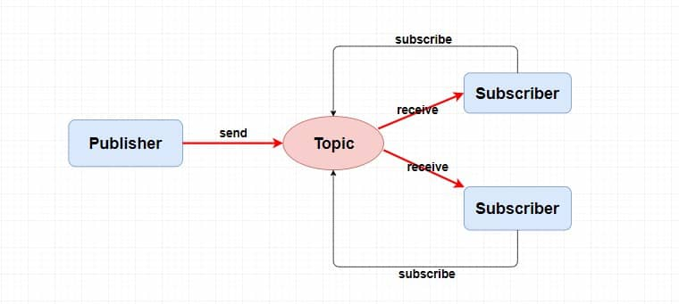


- 

- **为什么每个消费组在每个队列上都维护一个消费位置？**
  - 发布订阅模型中，一般涉及到多个消费组，每个消费组在队列上的消费位置都不同
  - 如果不维护消费位置，没有办法知道每个消费者的消费进度
  - 消息被消费后不会被删除，其他消费组也需要这个消息。只需要将消息位置 + 1
- **为什么一个主题要维护多个队列**

  - 提高并发能力
  - 多个生产者向多个队列发送消息肯定比多个生产者向单一队列发送消息速度快
  - 同理，同一个消费者组中，一个消费者对应一个队列，如果组中存在多个消费者，单一队列就浪费了多消费者的消费能力


### 3.RocketMQ架构

- RockeMQ架构中有四大角色`NameServer`，`Broker`，`Producer`，`Consumer`
  - `Broker`：主要负责消息的存储，投递和查询以及高可用保证，说白了就是服务器上的MQ服务，生产者生产消息到`Broker`，消费者从`Broker`拉去消息并消费
    - Broker，Topic，Queue的关系
      - **一个 `Topic` 分布在多个 `Broker`上，一个 `Broker` 可以配置多个 `Topic` ，它们是多对多的关系**
      - 一个`Topic`有多个`Queue`，它们是一对多关系
    	- 
  - `NameServer`：注册中心，负责`Broker`管理和路由信息管理
    - `Broker`会将自己的信息注册到`NameServer`中，生产者和消费者从`NameServer`中获取路由访问`Broker`
  - `Producer`：生产者
  - `Consumer`：消费者
    - 消息获取方式：支持push推和pull拉两种模式
      - push模式：Broker主动将消息推送给消费者
      - pull模式：消费者主动从Broker拉去消息
    - 消息分发的方式：支持集群方式和广播方式
      - 集群方式：对于**每个消费者组**，消息只被<font color='red'>**一个**</font>消费者消费
      - 广播方式：对于**每个消费者组**，消息只被<font color='red'>**每个**</font>消费者消费
  - 
  - `Broker`做了集群且进行**主从**部署
    - Broker提供`Master-Slave`模式，主节点宕机后，<font color='red'>**从节点提供消费服务，不提供写入消息服务**</font>
  - 为保障**高可用**，NameServer做了集群部署
    - 采用**去中心化**结构，每个Broker与所有nameServer保持长连接，定时发送心跳，包含自身Topic配置信息
    - 生产者向`Broker`发送消息时，先从NameServer获取Broker路由信息，然后通过<font color='red'>**轮询**</font>方式向每个队列发送数据，以此达到**负载均衡**
  

### 4.对比Kafka、RabbitMQ有什么优势

RabbitMQ 从性能上不及 RocketMQ、Kafka、功能上不及 RocketMQ，国内目前应用场景没那么大众，所以不参与比对。

- 功能方面：
  - Kafka 不支持广播消息。
  - Kafka 不支持延时消息。
  - Kafka 不支持事务消息。
  - Kafka 在处理顺序消息时，如果一台 Broker 宕机后，会产生消息乱序。而 RocketMQ 如果消息消费失败，会暂停消费。
  - 存疑点：网上说当 Kafka 分区多的时候，性能会下降，RocketMQ 不会。
- 语言方法：
  - Kafka 使用 Java 和 Scala，针对一些框架原理查看以及二次开发不便利。
- 使用场景：
  - Kafka 侧重于通过流处理引擎实现实时数据流处理，在大数据流处理和实时数据分析方面使用较多。
  - RocketMQ 的设计更注重实现高可用和多功能的消息服务，在国内较多公司应用较为广泛。

综合比对，Kafka 的优势在于性能高，而 RocketMQ 的功能和业务场景更贴合国内公司，所以使用也较多。

### 5.[RocketMQ消息推模式/拉模式](http://wuwenliang.net/2022/05/11/%E6%8E%A8%E4%B8%8E%E6%8B%89%EF%BC%8CRocketMQ%E6%B6%88%E6%81%AF%E6%B6%88%E8%B4%B9%E7%9A%84%E9%82%A3%E4%BA%9B%E5%A7%BF%E5%8A%BF/)

- **拉模式**：消费者主动向`Broker`拉取消息，实时性差，消费者压力小
  - `DefaultMQPullConsumer`
    - RocketMQ中的“拉”模式消费方式需要开发者显式维护消费进度，每次消费成功需要**手动维护offset**

    - ~~实现流程（仅作为理解，不需要讲）~~
      - ~~获取Topic中所有队列信息~~
      - ~~遍历队列，通过pull方法从Broker端拉取消息~~
      - ~~消息处理~~
      - ~~调用`updateConsumeOffset`更新偏移~~

- **<font color='red'>推模式</font>**：`Broker`主动向消费者推送消息，实时性好，消费者压力大
- RocketMQ中采用一种伪推送模式，实际上还是用的拉模式
  
- 消费者在后台通过**<font color='red'>长轮询</font>**的方式拉取数据
  
  - **长轮询**：
      - 本质还是轮询，**定时发送请求**
    - **长轮询特点**：在Broker在没有新消息的时候才阻塞，有消息会立刻返回，或者超时返回
  
- **为什么不用真正的推模式**
    - 首先是加大 Server 端的工作量，需要动态感知Consumer端的存在，进而影响 Server 的性能
    - 其次Client 的处理能力各不相同， Client 的状态不受 Server 控制
    
  - `DefaultMQPushConsumer`
  - 在MessageListener的回调函数里进行消息处理，然后返回消息的状态
    - 由于返回了消息的状态，服务端会维护每个消费端的消费进度，**不需要手动更新消费进度**


### 6.消息丢失如何解决

- 消息丢失场景和解决
  - 
  - **生产者产生消息发送给MQ**，发生网络波动，消息可能丢失
    - 解决方案： 
      - 通过配置生产者的重试次数
      - 或者使用MQ分布式事务
  - **MQ持久化消息阶段**，有两种情况发生消息丢失
    - MQ异步刷盘，消息只写入到操作系统的`page cache`还没有刷盘成功，此时broker宕机，数据丢失
      - 解决方案：**同步刷盘策略**，MQ会等待刷盘成功返回`ACK`
    - 消息写入磁盘，但是数据没有备份，磁盘损坏
      - 采用**集群**方式部署 + **主从**模式 + **同步复制**模式
  - **消费者消费消息阶段**
    - 一般的同步消费由于MQ的重试机制存在，不会造成消息丢失
    - 异步消费，由于业务代码处理不合理会导致消息丢失，
    - 业务代码还没执行完，就返回`ACK`给`Broker`，一旦消费失败，消息就丢失了

### 7.什么是消息的ACK机制 

- ACK机制是一个消息确认机制，用来确保消息被成功消费
- RocketMQ中，消息进度通过消费者在`queue`上的`offset`记录，消费者每次批量拉取消息，`offset`为一批消息中的最小值
- 消费者消费完批量消息后，发送到`broker`一个`ACK`来更新`queue`上的`offset`
- 这种**一批消息一个`ACK`**与**一个消息一个`ACK`**相比
  - 减少网络通讯，效率提升
  - 重复消费问题
    - 就可能出现拉取了100条消息如 101 - 200的消息，后面99条都消费结束了，只有101消费一直没有结束的情况，就需要全部重新消费
- 

### 8.什么是消息的重试机制

- 当消费者处理消息失败或ACK没有发生成功的情况，需要消息重试机制保障消息不丢失
- 生产端消息重试
  - 默认重复两次，立即重试
- <font color='red'>**消费端消息重试**</font>
  - 顺序消息重试
    - 每隔1秒重试
    - 消息消费被阻塞，因为要保证消息的顺序
  - 无序消息重试
    - 默认重复**16**次，重试时间间隔越来越长
- 消息重试原理
  - **延迟队列 -> 重试队列 -> 死信队列**
  - RocketMQ为每隔消费者组设置了一个`Retry`重试队列，用于暂时保存所有消费失败的消息
  - 考虑到异常恢复需要时间，RocketMQ设置了一个`Schedule_TOPIC`延迟队列，重试次数越多的消息，重试延迟越高
  - MQ先将消息放到延迟队列中，后台定时任务按照对应的延迟时间将消息加入到重试队列中
  - 重试次数超过16次，则加入死信队列，需要人为处理


### 9.[如何保障消息消费顺序性](https://juejin.cn/post/7149152825426542600)

- 普通顺序消费：**消费者通过同一个消费队列收到的消息是有顺序的**，不同消息队列收到的消息则可能是无顺序的
  - 生产者端通过对消息**<font color='red'>Hash取模</font>**放入到相同的队列中
    - 通过`MessageQueueSelector`来实现队列的选择
- 严格顺序消费：消费者收到的 **所有消息** 均是有顺序的。严格顺序消息 **即使在异常情况下也会保证消息的顺序性** 。
  - 存在性能问题，`Broker` 集群中只要有一台机器不可用，则整个集群都不可用
  - 目前已知的应用只有数据库 `binlog` 同步强依赖严格顺序消息
  - **`MessageListenerOrderly`**：消费端想要实现顺序消费，只要设置监听器实现`MessageListenerOrderly`接口

### 10.消息重复消费如何解决

- 出现消息重复消费原因有很多，比如消费者没有成功发送ACK到broker，broker就会重新发送消息
- 实现消费者的**<font color='red'>幂等性</font>**，需要结合具体业务
  - 幂等性：一个操作**多次**执行所产生的影响均与**一次**执行的影响相同
  - Redis提供的`setNX`命令，把这个消息通过`setNX`写入到Redis里面，避免重复写入
    - `setNX`：set if not exists，只有当key不存在，才能插入成功
  - 数据库唯一约束（唯一索引）
    - 数据库兜底的方式，保证不会插入多条相同数据来实现幂等性

### 11.消息消息积压如何解决

- 消息堆积出现场景
  - 生产者生产过快，消费者消费过慢
-  解决方案
  - 首先判断消费者是否出现大量消费失败情况，因为消费失败会导致MQ消息重发
  - 增加同一个`Conusmer group`中的`Consumer`实例数量。通过**增加集群节点**或**多开进程**方式，需要同步增加主题中的**队列数量**
  - 增加单个`consumer`中的消费并行线程，默认是20个消费线程。通过修改参数 `consumeThreadMin`、`consumeThreadMax`实现
  - 丢弃不重要消息，赶上生产者进度
    - 如果业务对数据要求不高的话，可以选择丢弃不重要消息

### 12.如何完成定时消息

- 定时消息是指消息发到`Broker`后，不能立刻被消费者消费，要到特定的时间点或者等待特定的时间后才能被消费。 
- 实现原理
  - 生产者生产一个定时消息`Topic`为`A`
  - 在`Broker`上，先讲消息的`Topic`改为`Schedule_Topic_A`，`QueueId`改为`delay level - 1`存入`CommitLog`，将消息放入对应的延迟队列中~~（queueId是生产者根据轮询得到的Topic下的一个queue的id）~~
  - 后台线程**定时扫描**延时队列，消息到期重新写入`CommitLog`，修改`Topic`为**原始值**
  - 转发到对应的目标消息队列上去进行消费 
- 

### 13.什么是零拷贝

- 零拷贝：减少数据在内存中拷贝次数，以此提高IO效率

- 传统IO读写：四次用户态与内核态切换，四次数据拷贝

  - 个人理解：IO读写：**读就是从磁盘中读取到用户缓冲区，写就是将数据写入到磁盘/网卡**

- 

- 零拷贝实现方式

  - `sendfile`

    - 直接将数据从page cache拷贝到Socket缓冲区，不经过用户态缓冲区。
    - 两次用户态与内核态切换，两次拷贝
    - 用户不能读写数据，直接发送

  - 

  - `mmap + write`**<font color='red'>（RocketMQ实现方式）</font>**

    - 通过将文件映射到进程的虚拟内存空间，减少数据从内核态到用户态的拷贝

    - 四次用户态与内核态切换，三次数据拷贝

    - 具体流程

      - `mmap`：切换到内核态，将数据从文件拷贝到page cache，建立文件地址与进程虚拟内存空间的映射，切换到用户态
      - `write`：切换到内核态，将数据从page cache拷贝到Socket缓冲区，再拷贝到网卡中，切换回用户态

      

  - 


### 14.如何完成部署高可用

- 高可用性是指系统在长时间运行中能提供持续服务的能力，最大限度地减少停机时间。
- RocketMQ高可用一般通过部署NameServer集群和Broker集群
  - NameServer集群部署
    - 每个节点保存信息一致，只要有一个节点存活，就能保证MQ正常运行
  - Broker集群部署
    - 多主
      - 集群中所有节点都是主节点，没有从节点
      - 优点
        - 配置简单，性能最高
      - 缺点
        - 节点宕机后，节点上的消息不能被消费，实时性差
      - 
    - 多主多从--异步复制
      - 每个主节点配一个从节点，主从之间采用异步复制（**消息写入主节点之后就直接返回写入成功** ）
      - 优点
        - 即使磁盘损坏，消息丢失少，实时性不受影响，性能较好
        - 主节点宕机后，在从节点消费
      - 缺点
        - 主节点宕机，不会手动切换主从节点
        - 可能会少量丢失消息
      - 
    - 多主多从--同步双写
      - 每个主节点配一个从节点，同步双写就是消息要同步写到主从节点上
      - 优点
        - 消息不会丢失，没有单点故障问题，可用性较高
      - 缺点
        - 主节点宕机，不会手动切换主从节点
        - 性能略差于异步复制模式
      - 
    - Dledger模式
      - 集群中至少要有三个`broker`，一个主节点，两个从节点，三个为一组
      - 一旦主节点宕机，从剩下两个从节点选举出一个主节点
      - 解决了主从模式中主节点宕机，不能自动切换的问题
      - 

### 15.发送一条消息需要多长时间

### 16.如何发送一条消息到Broker

### 17.RocketMQ刷盘策略

- 刷盘路径：`broker`缓存-> 操作系统的`page cache` -> 磁盘

- 同步刷盘：需要等消息刷入磁盘返回ACK
- 异步刷盘：将消息写入操作系统的`page cache`就返回ACK
- 

### 18.RocketMQ存储结构

- RocketMQ存储结构中两大角色——`CommitLog`和`ConsumeQueue`
- `CommitLog`
  - 消息存储主体，将Producer端的消息<font color='red'>**顺序写入**</font>到日志文件中（不管Topic）
  - RocketMQ采用混合型存储结构，单个Broker实例下所有队列公用一个CommitLog，提高数据写入效率，因此才需要ConsumeQueue作为索引
- `ConsumeQueue`
  - 基于`Topic`的`commitLog`索引文件，保存的是指定`Topic`下指定`queue`的消息在`CommitLog`中的物理偏移量，文件大小等
  - 文件夹结构：**`topic/queue/file`**


## 并发编程
### 1.线程池高频考点

#### 1.1线程池有哪些应用场景

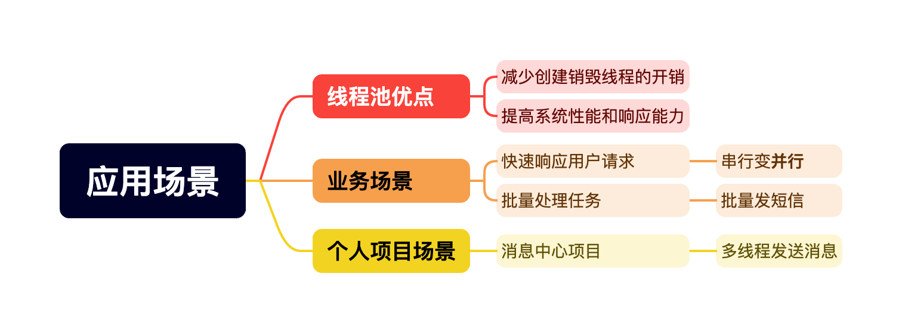

- 线程池优点
  - 线程池是一种池化思想管理线程的工具，使用线程池可以减少创建和销毁线程的开销，避免创建线程过多导致资源耗尽，提高系统性能和响应能力
- 业务场景
  - 快速响应用户请求
    - 电商平台查询商品详情接口：需要获取商品基本信息，库存信息，优惠券等信息，如果串行查询效率低下，使用线程池并行查询信息，可以缩短用户响应时间
  - 批处理任务
    - 批量发送短信：假设有10个线程同时发送，理想情况下效率提升10倍
- 个人项目场景
  - 消息中心项目中，上游系统将需要发送的消息投递给MQ，消费者从MQ拉取消息后，采用线程池批量发送消息来增强消费者消费能力

#### 1.2如何设置线程池参数


- 线程池比较重要的参数有核心线程数，最大线程数，阻塞队列，拒绝策略
- 核心线程数
  - 对于CPU密集型任务，大部分时间都在进行CPU计算，**线程数选择CPU核数 + 1**；+1是为了防止线程偶发的缺页中断
  - 对于IO密集型任务，因为IO密集型任务大部分时间在等在外部设备的IO操作，**线程数选择CPU核数 * 2个**
  - **特殊情况：**如果项目中线程池不多，核心线程数 = CPU核数 / (1 - 阻塞系数)，阻塞系数一般是0.8～0.9。这样可以充分发挥CPU性能
- 最大线程数：采用核心线程数 * 2
- 阻塞队列：
  - 有界队列：`ArrayBlockingQueue`
  - 无界队列：`LinkedBlockingQueue`，默认Integer.MAX_VALUE，可以设置队列大小，最常用
  - 同步队列：`SynchronousQueue`，队列不存储任务，直接将任务交给工作线程，核心线程数满了就直接创建新线程，直到最大线程数
- 拒绝策略
  - 丢弃任务，抛出异常
  - 丢弃任务，不抛出异常
  - 丢弃最先进入队列的任务
  - `CallerRunsPolicy`，提交任务的线程执行，即主线程执行任务

#### 1.3线程池工作原理

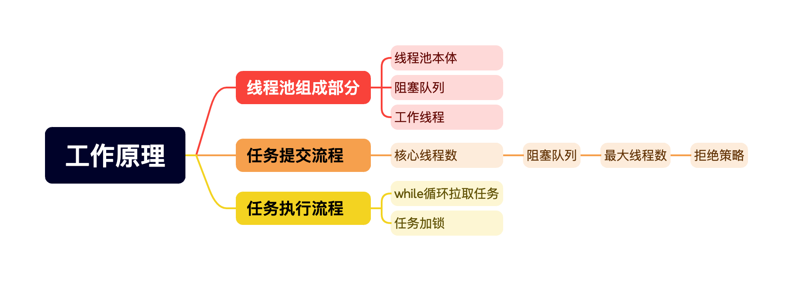

- 线程池一般指的是`ThreadPoolExecutor`，基于生产者消费者模型实现的，从功能划分成三个部分
  - 线程池本体：管理工作线程，任务调度
  - 阻塞队列：扮演生产者消费者中间的缓冲区，工作线程从阻塞队列不断拉取并执行任务
  - 工作线程：Thread对象内部都有一个Worker，Worker不断从阻塞队列中拉取并执行任务
- 任务提交工作流
  - 如果当前线程数小于核心线程数，则创建一个新的工作线程执行任务
  - 如果当前线程数大于等于核心线程数，且阻塞队列未满，将任务添加到阻塞队列
  - 如果阻塞队列已满，且线程数小于最大线程数，则创建一个新的工作线程执行任务
  - 如果线程数大于最大线程数，则执行拒绝策略 


- 任务执行工作流：当启动一个工作线程，它会在while循环中重复执行一套逻辑
  - `getTask`从阻塞队列获取任务~~(启动工作线程会自带一个任务)~~，拿不到任务就阻塞一段时间，直到拿到任务进入下个阶段或者超时进入线程退出流程
  - 通过`Woker`的`lock`加锁，确保一个线程只执行一个任务
  - 执行任务
  - 解锁
  - 线程因为异常中断，则进入线程退出流程，否则进入循环
  - <font color='red'>只有当worker获取任务超时或者执行任务出现异常，才会进入线程退出流程去销毁线程</font>


<details>
  <summary><font color='red'><strong>详细原理介绍</strong></color></summary>
  <pre><font color='black'><strong>1.工作线程 Worker</strong>
  <font color='red'>每个工作线程都对应一个内部类<code>Worker</code>，一个工作线程就是一个<code>Worker</code>(工作者)</font>
  <code>ThreadPoolexecutor</code>中，通过一个全局变量<code>HashSet</code>存储和管理<code>worker</code>
  <code>Worker</code>实现了<code>Runnable</code>接口，创建一个<code>Worker</code>实例时，在构造函数中线程工厂创建的<code>Thread</code>对象，将<code>Worker</code>与<code>Thread</code>绑定
  <code>Worker</code>继承了<code>AQS</code>来保证工作线程是线程安全的
  </font></pre>
  <pre><font color='black'><strong>2.主锁 mainLock</strong>
  <code>ThreadPoolExecutor</code>中使用一个<code>HashSet</code>存<code>Worker</code>实例，但是<code>HashSet</code>本身非线程安全，如何保证线程安全？
  实际上，除了 workers 以外，线程池中还有大量非线程安全的变量，这里再举几个例子：
	● ctl：记录线程池状态与工作线程数。
	● largestPoolSize/corePoolSize：最大/核心工作线程数。
	● completedTaskCount：已完成任务数。
	● keepAliveTime：核心线程超时时间。
  线程池用一个<code>ReentrantLock</code>实现的主锁<code>mainLock</code>，每次操作全局变量时，都需要获取主锁
  总的来说，线程池通过 mainLock 来保证全局配置的线程安全，而每个工作线程再通过 AQS 来保证工作线程自己的线程安全。
  </font></pre>
  <pre><font color='black'><Strong>3.任务执行</Strong>
  线程池通过<code>addWorker</code>方法启动一个新线程，创建一个<code>Worker</code>对象,构造函数将<code>Worker</code>与线程绑定，调用线程池的<code>runWorker</code>方法，通过while循环去获取任务
	● 通过<code>getTask</code>方法从工作队列中获取任务，如果拿不到就阻塞一段时间，直到获取到任务进入下一个阶段或者<strong>超时</strong>进入线程退出流程
	● 调用<code>Worker</code>的<code>lock</code>方法加锁，确保一个线程只被一个任务占用
	● 调用<code>beforeExecute</code>回调方法，然后执行任务
	● 调用<code>afterExecute</code>回调方法，这两个方法都是空的，需要自定义
	● 如果线程因为<strong>异常中断</strong>，则进入线程退出流程，否则回到步骤1
	● <font color='red'>只有当worker获取任务超时或者执行任务出现异常，才会进入线程退出流程去销毁线程</font>
	● 同样的，<font color='red'><code>getTask</code>获取任务超时，说明当前线程数大于核心线程数，或者设置了核心线程超时销毁</font>
  </font></pre>
</details>


#### 1.4项目宕机时线程池任务没处理完


- 优雅停机方案
  - 如果线程池中任务数量不多，可以实现`Spring`的`DisposableBean`接口，改写`destroy`方法，在容器关闭时调用线程池的`shutdown`方法和`awaitTermination`方法
  - `shudown`保证线程池有序关闭，继续执行已提交的任务，但不保证所有任务完成
  - `awaitTermination`设置了一个等待时间，让所有提交的任务完成
  - 如果任务数过多，还是会丢失任务
- 消息队列方案
  - 如果线程池中任务很多，可以借助消息队列保证数据不丢失
  - 先将任务投递到消息队列，消费者端从Broker拉取任务进行消费，即使项目重启，任务会在MQ中持久化，配合优雅停机方案，最大程度避免任务丢失
  - 可以使用synchrnousQueue，阻塞队列不存储任务则不会丢失

#### 1.5线程池execute和submit


- `execute`和`submit`都是用来线程池中任务提交的，但有几个不同点

- |              | execute                        | submit                                                       |
  | ------------ | ------------------------------ | ------------------------------------------------------------ |
  | **返回值**   | 不需要返回值的任务，没有返回值 | 用于需要返回值的任务，返回值封装在`Future`对象中，`Future.get`获取 |
  | **异常处理** | 直接抛出异常，传播到调用线程   | 不抛出异常，将异常封装到`Future`对象中返回                   |


#### 1.6线程池如何实现线程复用&超时回收

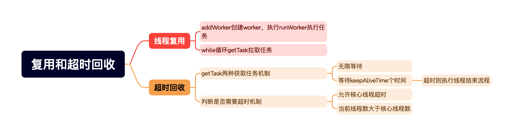

##### 1.6.1线程复用

- 当线程池通过`addWorker`方法创建工作线程后，通过`runWorker`执行任务，执行完之后不会销毁，而是通过`while`循环反复调用`getTask`方法从阻塞队列中获取任务

##### 1.6.2超时回收

- `getTask`有两种机制：
  - 无限期等待阻塞队列中有了任务再返回
  - **设置一个等待时间，如果超过等待时间，`getTask`返回空，执行线程销毁流程**
- 两种情况可以设置等待时间
  - 允许核心线程超时
  - 当前线程数大于核心线程数

#### 1.7线程池如何实现不丢弃任务

- 拒绝策略CallerRunsPolicy
- 动态线程池监控，调整参数

#### 1.8为什么不建议使用Executors创建线程池


- 有任务积压，资源耗尽风险：比如`singleThreadPool`和`FixedThreadPool`使用的阻塞队列是`linkedBlockingQueue`，默认是无界的，容易大量任务堆积，导致OOM
- 线程数不可控风险：比如`cachedThreadPool`使用的阻塞队列是`SynchronousQueue`，容易创建过多线程，也会导致OOM
- 不够透明：无法清晰地了解其内部工作机制和潜在问题，这对于性能调优和故障排查都是不利的。
- 建议直接通过ThreadPoolExecutor创建线程池，对于线程数、阻塞队列和拒绝策略可以由开发者自己选择，对线程池控制更加精确

#### 1.9如何处理线程池任务运行异常

#### 1.10如何监控线程池的运行性能指标

#### 1.11如何感知线程池触发拒绝策略

#### 1.12线程池如何实现快速消费

https://blog.csdn.net/laodanqiu/article/details/137358034


### 2.阻塞队列高频考点

#### 2.1什么是阻塞队列

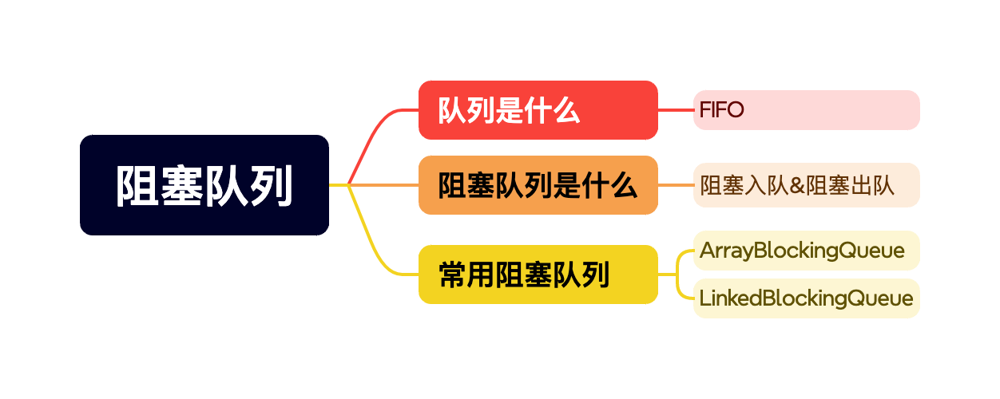

- 队列是一种先进先出的数据结构
- 阻塞队列是在队列的基础上，加上两个特殊操作
  - 阻塞入队：当队列容量满时，插入元素阻塞，直到队列有多余容量
  - 阻塞出队：当队列容量为空时，移除元素阻塞，直到队列存在元素
- `BlockingQueue`是JDK的一个接口，常用的阻塞队列实现类有`ArrayBlockingQueue`和`LinkedBlockingQueue`
  - 从并发的角度讲，`ArrayBlockingQueue`入队和出队共享同一把锁，在高并发的情况下，锁竞争激烈，导致性能下降
  - 而`LinkedBlockingQueue`入队和出队是两把锁，在高并发下，性能较好

#### 2.2[说下阻塞队列实现原理](https://juejin.cn/post/7221183644576514104)

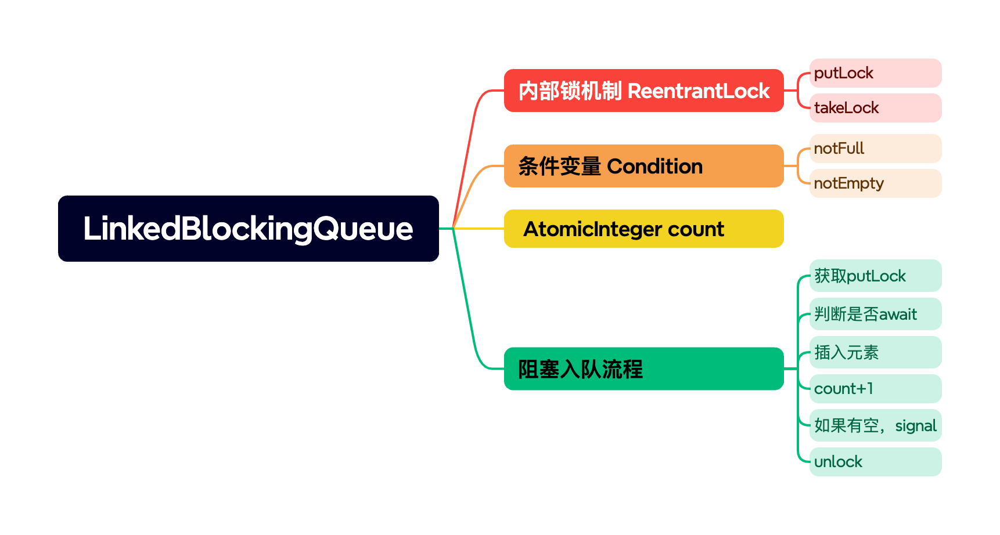

- 如果面试官没有问上面什么是阻塞队列问题，可以把队列、阻塞队列的概念讲讲
- `LinkedBlockingQueue`通过
  - 两个`ReentrantLock`：`putLock`和`takeLock`保证不会有两个线程同时进行入队或者出队操作
  - 两个`Condition条件变量`：`notfull`和`notEmpty`，通过`await`和`signal`实现入队和出队的阻塞
  - 一个`AtomicInteger`的`count`，原子类保证队列内元素数量的原子性
- 具体流程，以`put`入队方法为例
  - 先获取putLock
  - 然后判断队列容量是否已满，如果满了则`notfull.await`阻塞，并释放锁，**直到其他线程调用`signal`唤醒当前线程**
  - 插入元素，`count` + 1
  - 判断队列容量是否已满，不满的话，调用`notfull.signal`唤醒其他线程
  - 解锁
  
  ReentrantLock：阻塞其他线程
  
  ​	lock，unlock
  
  
  
  Condition ：主动阻塞当前线程，需要其他线程来唤醒
  
  ​	await：阻塞线程并释放锁
  
  ​	 signal：唤醒第一个被await阻塞的线程，但不是立即唤醒，需要参与锁竞争

<details>
  <summary><font color='red'><strong>ReentrantLock和Condition个人理解</strong></color></summary>
  <pre><font color='black'><strong>ReentrantLock</strong>：阻塞其他线程
<strong>Condition条件变量</strong>：主动阻塞当前线程，需要其他线程来唤醒
  await：阻塞并释放锁
  signal：唤醒第一个被await阻塞的线程(变体CLH队列中的线程)，但不是立即唤醒，需要与新请求锁的线程进行锁竞争
  </font></pre>
</details>


#### 2.3ArrayBlockingQueue 和 LinkedBlockingQueue 有什么区别？


- `ArrayBlockingQueue`：
  - 创建必须指定容量大小
  - 基于数组，创建时预分配一块连续内存，内存利用率高，且没有链表结构的额外开销
  - 但由于入队和出队共享同一把锁，在高并发情况下，锁竞争激烈从而影响性能
- `LinkedBlockingQueue`
  - 创建默认为无界，实际是`Intger.MAX_VALUE`
  - 基于链表结构，内存占用逐渐增大，内存不连续，相对利用率低
  - 由于入队和出队用的是两把锁，在高并发情况下，锁竞争相对不激烈，从而效率较高
- 并发量高的情况下，选择`LinkedBlockingQueue`；对内存敏感的应用或对容量有明确限制的场景，选择`ArrayBlockingQueue`

### 3.ReentrantLock 高频考点

#### 3.1[ReentrantLock 底层怎么实现的？](https://juejin.cn/post/6896278031317663751#heading-9)


- `ReentrantLock`是一种可重入锁的实现，对一个资源可以重复加锁，底层依赖于`AQS`实现
- 获取锁的逻辑
  - 首先，`AQS`中有一个用`volatile`修饰的`state`代表锁的状态，**0**就代表没有被占用，先尝试用`CAS`方式修改`state`
  - 如果修改成功，说明请求资源没有被占用，将当前线程设置为**独占线程**，将资源锁定
  - 如果修改失败，说明资源被占用。将线程放入变体的CLH队列中等待，这个变体CLH队列有这么几个特点
    - 双向链表实现，head和tail都能操作节点，效率更高
    - 队列中的节点都会进行**<font color='red'>自旋</font>**尝试索取锁，区别于传统观念CLH队列，变体CLH在自旋一定次数后，就会阻塞线程，在高并发情况下，CPU利用率更高
  - 如果持有锁的线程释放锁，**state会减1**，直到**state==0**，则完全释放锁并唤醒队列中下一个线程
  - `ReentrantLock`支持公平锁和非公平锁，默认为非公平锁。
  - 使用**非公平锁**时，队列中唤醒的线程和新请求锁的线程会同时竞争锁，新来的线程可能先获取到锁，在高并发情况下，可能会导致一些线程有饥饿的情况

- 

#### 3.2ReentrantLock如何实现可重入

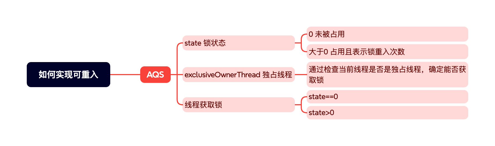

- `ReentrantLock`是基于`AQS`实现的，`AQS`内部维护一个的`state`表示锁的状态，值为0表示没有被占用，值大于0表示锁被持有且持有的次数
- `ReentrantLock`内部还维护一个Thread变量叫**`exclusiveOwnerThread`独占线程**，通过判断当前线程是否是独占线程，来获取锁
- 当线程想要获取锁时
  - 判断`state == 0`，表示锁未被持有，当前线程用CAS的方法将`state + 1`且设置独占线程为当前线程，以此来占有锁
  - 判断`state > 0`且独占线程就是当前线程，则表示当前线程已经持有锁，只需`state + 1`

#### 3.3公平锁和非公平锁哪个好


`ReentrantLock` 中，公平锁（Fair Lock）和非公平锁（Non-Fair Lock）各有优缺点，适用于不同的应用场景。

- 公平锁
  - 优点
    - 避免线程饥饿：因为线程需要按照加入队列的顺序获取锁，线程一定能获取到锁
    - 预测性好：也是因为线程需要严格遵守加入队列的顺序
  - 缺点
    - 性能较差：锁的获取与释放都需要操作队列，新线程想获取锁必须加入队列自旋后阻塞，上下文切换开销大
- 非公平锁
  - 优点
    - 性能较好：新线程和队列中唤醒的线程竞争锁， 新的线程有可能先获取到锁，避免加入队列阻塞导致的上下文切换开销
  - 缺点
    - 线程饥饿风险：由于新线程和队列中唤醒的线程同时竞争锁，极端情况下，队列中的线程可能长时间获取不到锁
- 使用场景
  - 公平锁：适用于需要严格获取锁顺序的场景
  - 非公平锁：适用于高并发场景，高并发的Web应用，计算密集型场景

#### 3.4ReentrantLock和synchronized有什么区别

#### 3.5读写锁原理


### 4.CAS 高频考点

#### 4.1乐观锁和悲观锁

- 乐观锁：在操作数据前假设不存在冲突，在数据提交时验证是否冲突，有冲突则重试
- 悲观锁：假设操作数据时有冲突，给数据上锁，再操作数据

#### 4.2什么是CAS，哪些使用场景


- **CAS是一种无锁的原子操作，通过比较和交换在并发场景中更新内存值**
- CAS包含三个值：旧值、预期值、新值
- 具体流程
  - 从内存中获取旧值
  - 检验旧值和预期值是否相等
  - 如果相等，将旧值替换为新值；如果不等，重复执行CAS操作
- CAS一般会配合自旋使用，构成自旋锁。优点是线程不阻塞，不需要上下文切换
- 基于这种自旋锁，CAS在 JUC 中使用很频繁。比如用于在并发场景下，需要对数据进行原子操作，例如`AtomicInteger`就是基于CAS + 自旋实现
- 在 JUC 中，基于 AQS 的锁，例如 `ReentrantLock`中最关键的 `state` 变量，它代表锁的状态，它是通过 CAS来更新的。在加入变体 CLH 队列时，也会尝试通过 CAS 和自旋的方式来更新 `state`，从而获取锁
- CAS可能会带来ABA问题：CAS判断某个变量是否可修改是根据变量的旧值和预期值是否相等。如果线程1想把变量从A修改到B，此时线程2将变量从A修改到B，从B修改到A。对线程1而言，旧值还是A符合预期，所以可以修改，这就是ABA问题

#### 4.3CAS的ABA问题


- CAS判断某个变量是否可修改是根据变量的旧值和预期值是否相等。如果线程1想把变量从A修改到B，此时线程2将变量从A修改到B，从B修改到A。对线程1而言，旧值还是A符合预期，所以可以修改，这就是ABA问题
- 解决方案：引入**单调递增的版本号机制**，通过双重CAS解决。先CAS更新版本号，再CAS更新变量
- JUC中的`AtomicStampedReference`就是这么实现的

#### 4.4如何解决 CAS 空转或者说高并发情况下如何实现内存计数器？


- 一般内存计数器用`AtomicLong`或`AtomicInteger`实现，但在高并发情况下，大量线程竞争资源会导致CAS频繁修改失败，导致大量线程处于空转的状态，大幅占用CPU资源
- 使用**`LongAdder`**可以解决CAS空转问题。它的核心思想为**<font color='red'>分段</font>**，将热点数据分散从而减少CAS失败的可能。
- `LongAdder`的结构是一个**`base`变量** + 一个**`cell[]`数组**
  - 没有竞争时，只会修改`base`的值。
  - 当CAS失败时，会将值累计在`cell`数组的某一位上，从而实现分散热点数据
  - 需要获取值时，对`base` + `cell`数组进行累加


#### 4.5并发场景下如何选择CAS和锁

- CAS是一种无锁的原子操作，通过自旋让线程在不阻塞的情况下对数据进行修改，从而避免上下文切换的开销。它非常适用于**读多写少**的场景。

- 锁机制可以确保操作的原子性和有序性。在并发写入的情况下，只有一个线程能获取到锁，其他线程会被阻塞等待，因此不会像 CAS 那样导致大量线程自旋。锁机制更适用于**写多读少**的场景。

### 5.ThreadLocal 高频考点

#### 5.1ThreadLocal底层实现原理

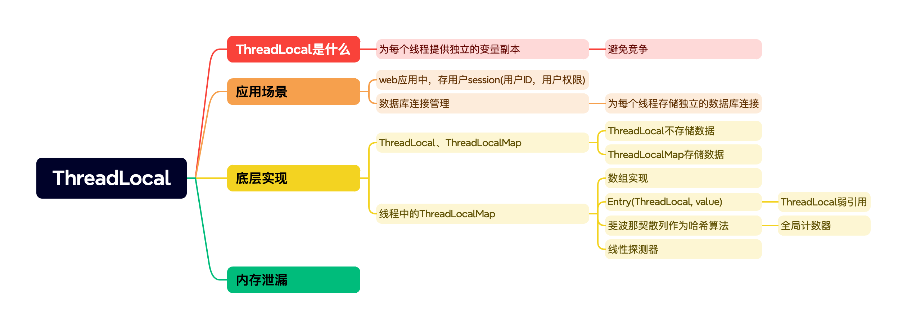

- `ThreadLocal`是什么
  - `ThreadLocal`是一种特殊的**线程本地存储机制**，用于在多线程环境中为**每个线程提供独立的变量副本**，从而避免线程间共享变量带来的并发问题
- `ThreadLocal`使用场景有
  - Web应用中，每个请求线程会用`ThreadLocal`存储`Session`信息(用户ID，用户权限)
  - 数据库连接池，为每一个请求线程存储独立的数据库连接
- 底层实现
  - `ThreadLocal`本身不存储数据，它有一个内部类叫`ThreadLocalMap`。每个线程中都有一个`TheadLocalMap`变量用来统一管理每个线程的`ThreadLocal`数据。
  - `ThreadLocalMap`类似`HashMap`底层就是一个数组。当一个线程访问 `ThreadLocal` 的时候，实际上是访问线程对象持有的 `ThreadLocalMap`，每个 `ThreadLocal`作为`key`和它对应的数据都会被封装为 `Entry` 对象并存储到 `ThreadLocalMap` 中。
  - `ThreadLocalMap`和`HashMap`不同的地方在于，它用斐波那契散列作为哈希算法。通过一个全局计数器，每创建一个`ThreadLocal`对象，采用一个特殊值的倍数作为哈希值
  - 对于哈希冲突，采用线性探测方法解决（一直往数组下一项找）
- 极端情况下可能会有内存泄露风险。

#### 5.2ThreadLocal什么场景内存泄漏

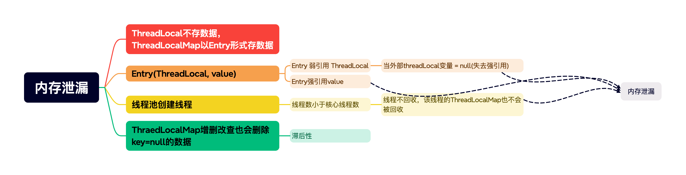

- ThreadLocal不存储数据，真实数据存储在每个线程的ThreadLocalMap中，以Entry的形式存储
- Entry的key就是ThreadLocal对象，是以弱引用的形式存在。弱引用对象在GC时会被回收。当Entry对应的这个`threadLocal变量=null`时，也就是所有强引用都失效，ThreadLocal对象会被回收，但是这个Entry对应的value又是一个强引用，所以不会被回收。导致这个Entry不能被获取，也不能被回收，只有当线程被销毁时，Entry才能回收
- 但是一般多线程采用线程池方式启动，如果当前线程完成任务，且线程数少于核心线程数，当前线程不会被销毁，那么线程不销毁，线程对应的ThreadLocalMap也不会销毁，导致内存泄漏
- ThreadLocalMap才增删改查时，会删除一些失效的Entry，但有滞后性

#### 5.3ThreadLocal有哪些扩展实现


- `ThreadLocal`：由于ThreadLocal数据是跟线程绑定的，所以父线程和子线程无法传递值
- `InheritableThreadLocal`：父线程在创建子线程时，可以将父线程数据拷贝到子线程，从而实现父子线程参数传递。但是如果使用线程池，由于线程不是每次新创建，所以无法使用
- **TTL** (`TransmittableTreadLocal`)：继承了InheritableThreadLocal，在此基础上提供了一种**快照机制**
  - 当父线程调用子线程时，会生成一份TTL快照
  - 在子线程运行之前，将父线程TTL的快照拷贝到子线程TTL
  - 在子线程执行结束，将TTL恢复到快照之前的状态


### 6.并发集合高频考点

#### 6.1Java 集合常见面试题总结

#### 6.2HashMap

#### 6.3ConcurrentHashMap

#### 6.4 为什么ConcurrentHashMap key和value不允许为 null

#### 6.5为什么ConcurrentHashMap JDK8放弃了分段锁

#### 6.6为什么ConcurrentHashMap读操作不用加锁


### 7.其他高频考点

#### 7.1三个线程轮流打印ABC三次

#### 7.2volatile关键字有什么用

#### 7.3 Synchronize关键字

#### 7.4什么是AQS

#### 7.5Thread的sleep和关键字wait区别


## 分布式

### 1.CAP & BASE理论

### 1.1 CAP定理

- CAP 定理指出对于一个分布式系统来说，当设计读写操作时，只能同时满足以下三点中的两个：
  - Consistency（一致性）：同一份数据在多个副本之间保持一致且最新
    - 每个节点可以访问到的数据都是一致的
  - Availability（可用性）：正常运行的节点在**合理的时间**内返回**合理的结果**（不是错误或者超时的响应），返回数据可能**不是最新的**
  - Partition Tolerance（分区容错性）：出现网络分区后，**每个分区**的系统仍能够提供一致性或者可用性的服务
    - 网络分区：分布式系统中，多个节点通过网络连接，由于某些故障导致节点之间不连通，整个网络被分为几块区域
- 不是所谓的“3选2”
  - P是必选项
    - 如果p不选，相当于出现网络分区后，整个系统宕机，违背分布式系统原理
    - CA相互矛盾：系统出现网络分区，如果要保证一致性，必须要禁止其他节点修改数据，这与可用性相违背。如果要保证可用性，需要在一定时间内返回合理的结果，如果进行了写操作，会导致数据不一致
- 总结：**如果系统发生“分区”，我们要考虑选择 CP 还是 AP。如果系统没有发生“分区”的话，我们要思考如何保证 CA 。**
- 应用案例
  - CP：ZooKeeper
  - AP：Eureka

### 1.2 BASE理论

- CAP理论的一种补充，更准确的说，是AP方案的补充
- 既然无法实现强一致性，每个系统根据自己业务特点，采用适当的方式实现最终一致性
- BA，S，E
  - Basically Available 基本可用
    - 在系统出现故障时，允许损失部分可用性能
      - 响应时间增长
      - 非核心功能不可用
  - Soft state 软状态
    - 允许数据存在中间状态，不同节点的数据副本同步存在延时
  - Eventually consistency 最终一致性
    - 系统中所有数据的副本，经过一段时间后，最终能达到一致的状态，不需要实时保证数据强一致性
    - 实现方法
      - 读时修复：读取数据时，检测到数据不一致，进行修复
      - 写时修复：写入数据时，检测到数据不一致，进行修复
      - 异步修复：定期执行修复任务，扫描数据并发现不一致之处。这些任务可以周期性地运行，并在发现问题时尝试修复数据


## TODO

### MyBatis

### SpringBoot

